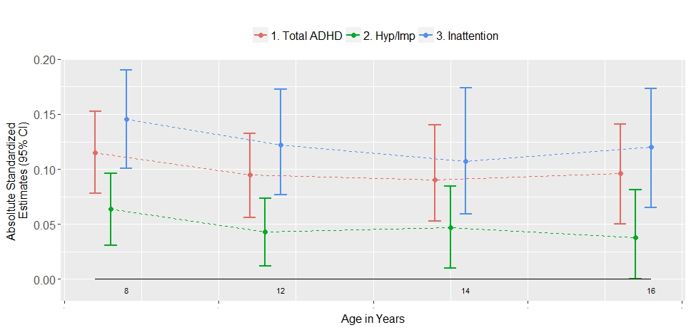
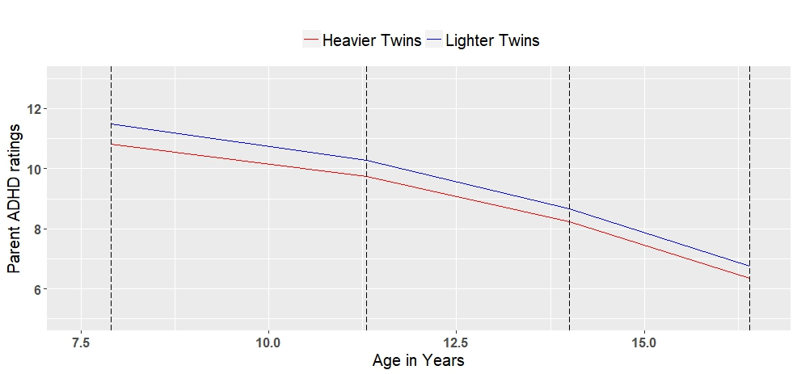
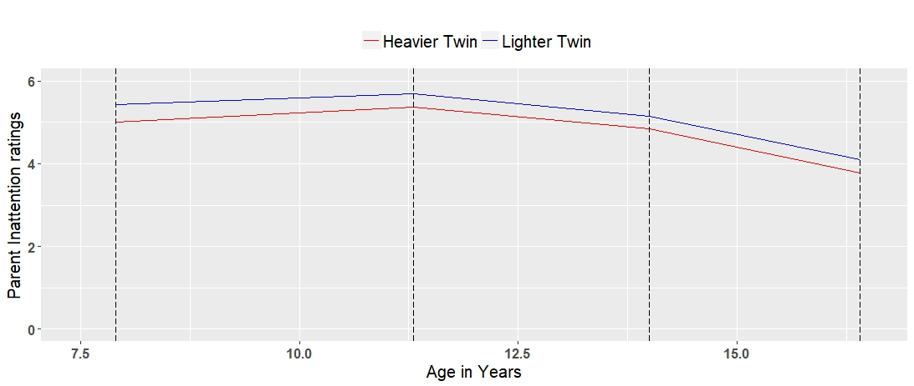
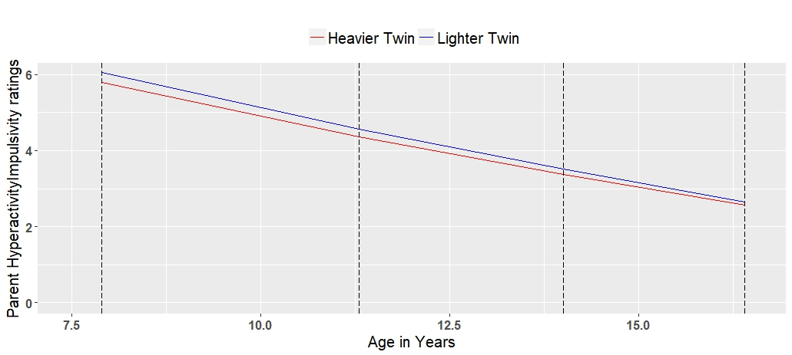

This document contains scripts used for [this paper](https://www.ncbi.nlm.nih.gov/pmc/articles/PMC6175300/pdf/JCPP-59-1036.pdf) that investigates the role of birth weight in ADHD development using twin data.  

```{r setup, include=FALSE}
knitr::opts_chunk$set(include = TRUE, eval=F)
#knitr::opts_chunk$set(tidy.opts = list(width.cutoff = 60), tidy = TRUE)

```

# Housekeeping

Loading the libraries, read the data, recode zygosity. 
```{r housekeeping}
rm(list=ls())
library(foreign)
library(car)
library(lavaan)
library(boot)
library(prettyR)
library(moments)
library(polycor)
library(psych)
library(GPArotation)
library(psy)
library(xlsx)
library(base)
library(matrixStats)
options(max.print=100000)
set.seed(1234) #set pseudo-random number generation to ensure bootstrapping results (confidence intervals can be reproduced)

adhddata=read.spss(filepath ,use.value.labels=F, to.data.frame=T)

#recode zygosity
adhddata$zygosL=NA; 
adhddata$zygosL <- factor(adhddata$zygos, levels = c(1,2), labels = c("MZ", "DZ"))

#check numbers after recode
table(adhddata$zygos,useNA="always");table(adhddata$zygosL,useNA="always");
```

For SDQ measures with < 3000 twin pairs (teacher's ratings and self-report), to increase the statistical power, we decided to pool the SDQ measures across different ages and get a mean value. 
```{r pooled SDQ}
##### >> 0. mean sdq to pool sdq with data points <3000 twin pairs#######

#create mean values for SDQ (teacher-rated) at age 7,9 and 12 - newtsdq1/2
adhddata$newtsdq1=NA
sdqt1=c("gtshypt1","itshypt1","ltshypt1")
adhddata$newtsdq1=rowMeans(adhddata[,sdqt1],na.rm=T)
table(is.na((adhddata$newtsdq1)),useNA = "always")
table(is.nan((adhddata$newtsdq1)),useNA = "always")


adhddata$newtsdq2=NA
sdqt2=c("gtshypt2","itshypt2","ltshypt2")
adhddata$newtsdq2=rowMeans(adhddata[,sdqt2],na.rm=T)
table(is.na((adhddata$newtsdq2)),useNA = "always")
table(is.nan((adhddata$newtsdq2)),useNA = "always")

#create mean values for SDQ (self-rated) at age 9, 12 and 16 - newcsdq1/2
adhddata$newcsdq1=NA
sdqc1=c("icshypt1","lcshypt1","pcbhsdqhypt1")
adhddata$newcsdq1=rowMeans(adhddata[,sdqc1],na.rm=T)
table(is.na((adhddata$newcsdq1)),useNA = "always")
table(is.nan((adhddata$newcsdq1)),useNA = "always")


adhddata$newcsdq2=NA
sdqc2=c("icshypt2","lcshypt2","pcbhsdqhypt2")
adhddata$newcsdq2=rowMeans(adhddata[,sdqc2],na.rm=T)
table(is.na((adhddata$newcsdq2)),useNA = "always")
table(is.nan((adhddata$newcsdq2)),useNA = "always")
```

Create a vector to store all the variables we used. The first two variables were birthweight of twin 1 and twin 2, whereas the rest of the variables were ADHD measures at different time points by different raters. As a rule of thumb, the first alphabet refers to the age in alphabetical order, e.g. a = age 1 years, b = age 2 years. 

[TEDS data dictionary](https://www.teds.ac.uk/datadictionary/home.htm) will have more information about these variables. You can navigate the left panel to different ages, and click on "Measures used in the booklets" to see the details. 
```{r vecoutcomes}
VecOutcomes= c("arkidgr1","arkidgr2", # birthweight
               "bbhhypt1", "bbhhypt2",
               "cbhhypt1","cbhhypt2",
               "dbhhypt1","dbhhypt2",                      
               "dsdhypt1","dsdhypt2",
               "gpshypt1","gpshypt2", 
               "hconnt1","hconnt2", "hconhit1", "hconhit2","hconint1","hconint2",
               "ipshypt1","ipshypt2",
               "lpshypt1","lpshypt2", 
               "lpconnt1","lpconnt2","lpconhit1","lpconhit2","lpconint1","lpconint2",
               "npconnt1","npconnt2","npconhit1", "npconhit2", "npconint1", "npconint2",
               "ppbhsdqhypt1","ppbhsdqhypt2", 
               "ppbhconnt1", "ppbhconnt2", "ppbhconnimpt1", "ppbhconnimpt2", "ppbhconninat1", "ppbhconninat2",
               "newcsdq1","newcsdq2",
               "newtsdq1","newtsdq2")
               
# newtsdq1/2 = mean of teacher-rated sdq at 3 ages 
# newcsdq1/2 = mean of chid-rated sdq at 3 ages


#create new name for dataframe
adhddatal=adhddata
```

# Descriptive statistics
## Table S3
The code chunk below produces the descriptive statistics (Table S3)
```{r descriptive stats}
################### >>>>> 1. Descriptive statistics ################

DesLoop=matrix(nrow = length(VecOutcomes),ncol=20)


for (i in seq(from=1,to=length(VecOutcomes),by=2))
{
  
 
  #define outcomes
  adhddatal[c("XD1","XD2")]=NA;
  adhddatal[c("XD1","XD2")]=adhddatal[,c(VecOutcomes[i],VecOutcomes[i+1])]
  
  adhddatalc= adhddatal[ !is.na(adhddatal$arkidgr1) &!is.na(adhddatal$arkidgr2) & !is.na(adhddatal$XD1) & !is.na(adhddatal$XD2)
                         & adhddatal$exclude=="0"  
                         & (adhddatal$sexzyg=="1"|adhddatal$sexzyg=="2"|adhddatal$sexzyg=="3"|adhddatal$sexzyg=="4"|adhddatal$sexzyg=="5"),]
  
 # adhddatalc = all MZ and DZ twins excluding those with medical conditions, without BW or ADHD data, unknown sex and unknown zygosity.  
  #select random
  adhddatalrc=adhddatalc[adhddatalc$random==1,]
  
  a=table(adhddatalrc$sexzyg, useNA="always")
  wholesample=a[1]+a[2]+a[3]+a[4]+a[5]
  DZsample=a[2]+a[4]+a[5]
  DZsamesex=a[2]+a[4]
  MZsample=a[1]+a[3]

  #whole sample
  wholemean=mean(adhddatalc$XD1)
  wholemean
  wholesd=sd(adhddatalc$XD1)
  wholeskew=skewness(adhddatalc$XD1)
  wholekurtosis=kurtosis(adhddatalc$XD1)
 
   #DZ sample
  adhddataDZ=adhddatalc[adhddatalc$zygosL=="DZ",]
  DZmean=mean(adhddataDZ$XD1)
  DZsd=sd(adhddataDZ$XD1)
  DZskew=skewness(adhddataDZ$XD1)
  DZkurtosis=kurtosis(adhddataDZ$XD1)
  
  #DZ same sex
  adhddataDZsame=adhddataDZ[adhddataDZ$sexzyg=="2"|adhddataDZ$sexzyg=="4",]
  DZsamemean=mean(adhddataDZsame$XD1)
  DZsamesd=sd(adhddataDZsame$XD1)
  DZsameskew=skewness(adhddataDZsame$XD2)
  DZsamekurtosis=kurtosis(adhddataDZsame$XD2)
  
  #MZ sample
  adhddataMZ=adhddatalc[adhddatalc$zygosL=="MZ",]
  MZmean=mean(adhddataMZ$XD1)
  MZsd=sd(adhddataMZ$XD1)
  MZskew=skewness(adhddataMZ$XD2)
  MZkurtosis=kurtosis(adhddataMZ$XD2)
  


  #Mean, SD, Kurtosis and Skew for all twins,  MZ twins , DZ twins and DZ same-sex twins
  VecRes=c(wholemean,wholesd,wholeskew,wholekurtosis,DZmean,DZsd,DZskew,DZkurtosis,
           DZsamemean,DZsamesd, DZsameskew,DZsamekurtosis,
           MZmean,MZsd,MZskew,MZkurtosis,wholesample,DZsample,DZsamesex,MZsample)
  DesLoop[i,1:20]=VecRes
  
  
}


colnames(DesLoop)=c("wholemean","wholesd","wholeskew","wholekurtosis","DZmean","DZsd","DZskew","DZkurtosis",
                    "DZsamemean","DZsamesd","DZsameskew","DZsamekurtosis","MZmean","MZsd", "MZskew","MZkurtosis",
                    "wholesample","DZsample","DZsamesex","MZsample")
rownames(DesLoop)=VecOutcomes

DesLoop=round(DesLoop[seq(from=1,to=length(VecOutcomes),by=2),],2)
DesLoop


#export to excel file
write.xlsx(DesLoop,"Revision-Newdataset descriptive statistics.xlsx")
```

## Total N of twins
This code chunk calculates the total number of twins involved to report in the Methods section: The final sample included 10,197 twin pairs (6,698 DZ pairs, 3,499 MZ pairs, 51.2% females). 
```{r twin number}
#################################### 1.1 To calculate total number of twins involved ###################################

#previous loop cannot calculate total number of twins in all analyses, only number of twins in each analysis. 
#this step is to calculate total number of twin pairs involved.

totaltwins= adhddatal[ !is.na(adhddatal$arkidgr1) &!is.na(adhddatal$arkidgr2) & 
                         ((!is.na(adhddatal$hconnt1) & !is.na(adhddatal$hconnt2))
                          |(!is.na(adhddatal$hconhit1) & !is.na(adhddatal$hconhit2))
                          |(!is.na(adhddatal$hconint1) & !is.na(adhddatal$hconint2))
                          |(!is.na(adhddatal$bbhhypt1)&!is.na(adhddatal$bbhhypt2))
                          |(!is.na(adhddatal$cbhhypt1)&!is.na(adhddatal$cbhhypt2))
                          |(!is.na(adhddatal$dbhhypt1)&!is.na(adhddatal$dbhhypt2))  
                          |(!is.na(adhddatal$lpconnt1) & !is.na(adhddatal$lpconnt2))
                          |(!is.na(adhddatal$lpconhit1) & !is.na(adhddatal$lpconhit2))
                          |(!is.na(adhddatal$lpconint1) & !is.na(adhddatal$lpconint2))
                          |(!is.na(adhddatal$dsdhypt1)&!is.na(adhddatal$dsdhypt2))
                          |(!is.na(adhddatal$gpshypt1)&!is.na(adhddatal$gpshypt2))
                          |(!is.na(adhddatal$ipshypt1)&!is.na(adhddatal$ipshypt2))
                          |(!is.na(adhddatal$lpshypt1)&!is.na(adhddatal$lpshypt2))
                          |(!is.na(adhddatal$ppbhsdqhypt1)&!is.na(adhddatal$ppbhsdqhypt2))
                          |(!is.na(adhddatal$npconnt1) & !is.na(adhddatal$npconnt2))
                          |(!is.na(adhddatal$npconhit1) & !is.na(adhddatal$npconhit2))
                          |(!is.na(adhddatal$npconint1) & !is.na(adhddatal$npconint2))
                          |(!is.na(adhddatal$ppbhconnt1) & !is.na(adhddatal$ppbhconnt2))
                          |(!is.na(adhddatal$ppbhconnimpt1) & !is.na(adhddatal$ppbhconnimpt2))
                          |(!is.na(adhddatal$ppbhconninat1) & !is.na(adhddatal$ppbhconninat2))
                          |(!is.na(adhddatal$newcsdq1)&!is.na(adhddatal$newcsdq2))
                          |(!is.na(adhddatal$newtsdq1)&!is.na(adhddatal$newtsdq2)))
                          & adhddatal$exclude=="0" #0= not excluded
                         & (adhddatal$sexzyg=="1"|adhddatal$sexzyg=="2"|adhddatal$sexzyg=="3"|adhddatal$sexzyg=="4"|adhddatal$sexzyg=="5"),]
#sexzyg 1=MZ male, 2=DZ male, 3=MZ female, 4=DZ female, 5= opposite sexes DZ, 7=unknown.

#try changing exlude="1", get total twins excluded from analysis due to medical condition. Number = 689 twin pairs. 

#arkiddr1/2 and akidgr1/2 difference = 28 individuals = 14 twin pairs. 
totaltwinsr=totaltwins[totaltwins$random==1,] #10,197 twin pairs, 3499 MZ, 6698 DZ
table(totaltwinsr$zygosL)
table(totaltwinsr$sexzyg, useNA = "always")
table(totaltwins$sexzyg,useNA = "always")
```

## More descriptive stats
Some check on the mean birth weight and within-twin pair correlation, and mean difference in birth weight. 
```{r mean birthweight and within-twin correlation}
####### 1.2 mean birth weight and within-twin pair correlation and mean difference in birth weight ################

#mean birth weights of boys and girls
boys=totaltwins[totaltwins$sex1==1,]
girls=totaltwins[totaltwins$sex1==0,]


table(boys$sex1)
table(girls$sex1)
mean(boys$arkidgr1, na.rm = T)
mean(girls$arkidgr1, na.rm = T)

#double check using sex2 column. 
boys2=totaltwins[totaltwins$sex2==1,]
girls2=totaltwins[totaltwins$sex2==0,]
mean(boys2$arkidgr2, na.rm = T)
mean(girls2$arkidgr2, na.rm=T)

# BW within-twin correlations for MZ and DZ same-sex twins. 
totalmz=totaltwinsr[totaltwinsr$zygosL=="MZ",]
table(totalmz$zygosL)
cor.test(totalmz$arkidgr1, totalmz$arkidgr2)
cor.test(totalmz$arkidgr1, totalmz$arkidgr2, method="kendall")

totaldzss=totaltwinsr[(totaltwinsr$sexzyg==2|totaltwinsr$sexzyg==4),] #DZ same sex twins
table(totaldzss$sexzyg)
cor.test(totaldzss$arkidgr1, totaldzss$arkidgr2)
cor.test(totaldzss$arkidgr1, totaldzss$arkidgr2, method="kendall")


mean(totalmz$arkidgr1);mean(totalmz$arkidgr2)
mean(abs(totalmz$arkidgr1-totalmz$arkidgr2))

mean(totaldzss$arkidgr1);mean(totaldzss$arkidgr2) # DZ twins slightly heavier, but may be due to sex composition
mean(abs(totaldzss$arkidgr1-totaldzss$arkidgr2))

```

## Table S1
This code chunk was used to produce Table S1
```{r study sample description}
####################### 1.3 Study sample description########################

#read job and maternal educ variable
ajob=read.spss("C:\\Users\\Kai Xiang Lim\\2016-2017 Psychology\\Dissertation\\data\\ajob.sav",use.value.labels=F, to.data.frame=T)
ajob=ajob[,c("id_twin","amojob","afajob")]
totaltwins=merge(totaltwins,ajob,by="id_twin",all.x=T)

maternaleduc=read.spss("C:\\Users\\Kai Xiang Lim\\Google Drive\\2016-2017 Psychology\\Dissertation\\data\\maternaleduc.sav",use.value.labels=F, to.data.frame=T)
maternaleduc=maternaleduc[,c("id_twin","amohqual","afahqual")]
totaltwins=merge(totaltwins,maternaleduc,by="id_twin",all.x=T)


identical(totaltwins$amohqual.x,totaltwins$amohqual.y)


#DESCRIPTION
prop.table(table(totaltwins$aethnic)) #1=white, 0=other, 92.9% white
prop.table(table(totaltwins$amohqual.x))#eductation description in 8 categories
prop.table(table(totaltwins$amohqual.y))#eductation description in 8 categories

sum(prop.table(table(totaltwins$amohqual.x))[4:8])#A-levels or higher for women, 37.7%
sum(prop.table(table(totaltwins$amohqual.y))[4:8])#A-levels or higher for women, 37.7%
prop.table(table(totaltwins$amojob)) #0=no, 1=yes, 2= caring at home 44.3%
prop.table(table(totaltwins$afajob)) #0=no, 1=yes, 2= caring at home 92.4%
prop.table(table(totaltwins$sex1))  #0=female, 1=male, female 51.2%
prop.table(table(totaltwins$zygos)) #1=MZ, 2=DZ, MZ 34.3%
```

## N of twins in each scale
This code chunk was used to calculate the number of twins in each scale. Reported in Table 1 and Table S3.
```{r number of twins in each scale}

######## 1.4 Loop for number of twins in each scale/age ########
#This loop will return a table of number of twins (Total, MZ, DZ Same sex) in each scale at each time point.
#VecOutcomes were defined above, but printing here again to ease readability.
VecOutcomes= c("arkidgr1","arkidgr2",
               "bbhhypt1", "bbhhypt2",
               "cbhhypt1","cbhhypt2",
               "dbhhypt1","dbhhypt2",                      
               "dsdhypt1","dsdhypt2",
               "gpshypt1","gpshypt2", 
               "hconnt1","hconnt2", "hconhit1", "hconhit2","hconint1","hconint2",
               "ipshypt1","ipshypt2",
               "lpshypt1","lpshypt2", 
               "lpconnt1","lpconnt2","lpconhit1","lpconhit2","lpconint1","lpconint2",
               "npconnt1","npconnt2","npconhit1", "npconhit2", "npconint1", "npconint2",
               "ppbhsdqhypt1","ppbhsdqhypt2", 
               "ppbhconnt1", "ppbhconnt2", "ppbhconnimpt1", "ppbhconnimpt2", "ppbhconninat1", "ppbhconninat2",
               "newcsdq1","newcsdq2",
               "newtsdq1","newtsdq2")


ResultsLoop=matrix(nrow = length(VecOutcomes),ncol=4)


for (i in seq(from=1,to=length(VecOutcomes),by=2))
{
  
  adhddatal=adhddata
  #define outcomes
  adhddatal[c("XD1","XD2")]=NA;
  adhddatal[c("XD1","XD2")]=adhddatal[,c(VecOutcomes[i],VecOutcomes[i+1])]
  
  adhddatalc= adhddatal[ !is.na(adhddatal$arkidgr1) &!is.na(adhddatal$arkidgr2) & !is.na(adhddatal$XD1) & !is.na(adhddatal$XD2)
                         & adhddatal$exclude=="0"  
                         & (adhddatal$sexzyg=="1"|adhddatal$sexzyg=="2"|adhddatal$sexzyg=="3"|adhddatal$sexzyg=="4"|adhddatal$sexzyg=="5"),]
  
  
  #select random
  adhddatalrc=adhddatalc[adhddatalc$random==1,]
  
  a=table(adhddatalrc$sexzyg, useNA="always")
  wholesample=a[1]+a[2]+a[3]+a[4]+a[5]
  DZsample=a[2]+a[4]+a[5]
  DZsamesex=a[2]+a[4]
  MZsample=a[1]+a[3]
  
  library(prettyR)
  #whole sample
  wholemean=mean(adhddatalrc$XD1)
  wholemean
  wholesd=sd(adhddatalrc$XD1)
  #DZ sample
  adhddataDZ=adhddatalrc[adhddatalrc$zygosL=="DZ",]
  DZmean=mean(adhddataDZ$XD1)
  DZsd=sd(adhddataDZ$XD1)
  #DZ same sex
  adhddataDZsame=adhddataDZ[adhddataDZ$sexzyg=="2"|adhddataDZ$sexzyg=="4",]
  DZsamemean=mean(adhddataDZsame$XD1)
  DZsamesd=sd(adhddataDZsame$XD1)
  #MZ sample
  adhddataMZ=adhddatalrc[adhddatalrc$zygosL=="MZ",]
  MZmean=mean(adhddataMZ$XD1)
  MZsd=sd(adhddataMZ$XD1)
  
  VecRes=c(wholesample,DZsample,DZsamesex,MZsample)
  ResultsLoop[i,1:4]=VecRes
  
  
}


colnames(ResultsLoop)=c("wholesample","DZsample","DZsamesex","MZsample")
rownames(ResultsLoop)=VecOutcomes


ResultsLoop=round(ResultsLoop[seq(from=1,to=length(VecOutcomes),by=2),],2)
ResultsLoop


write.xlsx(ResultsLoop,"number of twins in each scale.xlsx")

```

# Twin differences analyses

## Main twin difference syntax
I think this is the more exciting part, the code chunks in this section will produce the phenotypic, DZ and MZ estimates reported in Table 1 and Figure 2. 

Some commands which are commented out in the loop were used to inspect what happened line-by-line inside the loop when I developed the syntax. 
```{r twin differences analyses}
######## >>>>> 2.0 Phenotypic, MZ and DZ estimates ##################
#####  2.1 Standardised estimates (diff in 1 sd of BW predicts diff in sd of ADHD ratings) #######

#list of outcomes. Same as defined above, printed here again to ease readability.

VecOutcomes= c("arkidgr1","arkidgr2", 
               "bbhhypt1", "bbhhypt2",
               "cbhhypt1","cbhhypt2",
               "dbhhypt1","dbhhypt2",                      
               "dsdhypt1","dsdhypt2",
               "gpshypt1","gpshypt2", 
               "hconnt1","hconnt2", "hconhit1", "hconhit2","hconint1","hconint2",
               "ipshypt1","ipshypt2",
               "lpshypt1","lpshypt2", 
               "lpconnt1","lpconnt2","lpconhit1","lpconhit2","lpconint1","lpconint2",
               "npconnt1","npconnt2","npconhit1", "npconhit2", "npconint1", "npconint2",
               "ppbhsdqhypt1","ppbhsdqhypt2", 
               "ppbhconnt1", "ppbhconnt2", "ppbhconnimpt1", "ppbhconnimpt2", "ppbhconninat1", "ppbhconninat2",
               "newcsdq1","newcsdq2",
               "newtsdq1","newtsdq2")


#define boostrapping function
  bs <- function(formula, data, indices) {
  d <- data[indices,] # allows boot to select sample
  fit <- lm(formula, data=d) #type of formula, but formula itself is left to the boot call, which is better as we can used this generic boostrapp
  return(coef(fit))}


# Loop for run the analyses for each scale. 
ResultsLoop=matrix(nrow = length(VecOutcomes),ncol=9)
for (i in seq(from=1,to=length(VecOutcomes),by=2))
{
  
  adhddata2=adhddata
  #define outcomes
  adhddata2[c("XD1","XD2")]=NA;
  adhddata2[c("XD1","XD2")]=adhddata2[,c(VecOutcomes[i],VecOutcomes[i+1])]
  
  
  
  #for phenotypic estimate, inlcude opposite sex twins!
  adhddata2c= adhddata2[ !is.na(adhddata2$arkidgr1) &!is.na(adhddata2$arkidgr2) 
                         & !is.na(adhddata2$XD1) & !is.na(adhddata2$XD2)
                         & (adhddata2$sexzyg=="1"|adhddata2$sexzyg=="2"|adhddata2$sexzyg=="3"|adhddata2$sexzyg=="4"|adhddata2$sexzyg=="5"),]
  
  #scaling is done for each outcome, importantly this is done before selecting a twin at random, because if we do that separately for twin 1 and twin 2 we get rid of some differences 
  #(e.g. if mean difference between twin 1 and twin 2 is 0.2, then the within-twin pair difference for a pair which would have exact mean value would be 0.2 but if we standardize separately this would be 0)
  
  adhddata2c[,"arkidgr1"]=scale(adhddata2c[,"arkidgr1"]);adhddata2c[,"arkidgr2"]=scale(adhddata2c[,"arkidgr2"]);
  adhddata2c[,"XD1"]=scale(adhddata2c[,"XD1"]);adhddata2c[,"XD2"]=scale(adhddata2c[,"XD2"]) 
  #select random
  adhddata2rc=adhddata2c[adhddata2c$random==1,]
  

  
  #for phenotypic estimates
  modelCorrelatedRegression=
' XD1~rc*arkidgr1 #regression coeff for twin 1 
  XD2~rc*arkidgr2 #equal for twin 2 because twin selected at random
  arkidgr1~~pv*arkidgr1 #predictor variance, same for twin 1 and 2, produces warning in lavaan but ok and enables the standardized estimates of rv to be the same
  arkidgr2~~pv*arkidgr2 
  XD1~~rv*XD1 #residual var for twin 1
  XD2~~rv*XD2 #same twin 2
  XD1+XD2~id*1    # intercept
  arkidgr1+arkidgr2~ia*1    # intercept
  XD1~~XD2 #correlated residual variance, try comment out to see what it does when we omit it: i.e. increase in estimate
  '

  modelCorrelatedRegressionFit= sem(modelCorrelatedRegression, data=adhddata2rc, missing="fiml") 
  
  Estimates=parameterEstimates(modelCorrelatedRegressionFit,standardized=T);Estimates
  fit.boot <- lavaan(modelCorrelatedRegression, data = adhddata2rc,estimator ="ML", se="boot",bootstrap=10000)
  conint=parameterEstimates(fit.boot,boot.ci.type="bca.simple", level = .95) #95% CI from a boostrapped model
  lower.ci=conint$ci.lower[1]
  upper.ci=conint$ci.upper[1]
  Phe_est=Estimates$est[1]

  
  
  #select same sex twins
  adhddata3c= adhddata2[ !is.na(adhddata2$arkidgr1) &!is.na(adhddata2$arkidgr2) & !is.na(adhddata2$XD1) & !is.na(adhddata2$XD2) & (adhddata2$sexzyg=="1"|adhddata2$sexzyg=="2"|adhddata2$sexzyg=="3"|adhddata2$sexzyg=="4"),]
  #scale
  adhddata3c[,"arkidgr1"]=scale(adhddata3c[,"arkidgr1"]);adhddata3c[,"arkidgr2"]=scale(adhddata3c[,"arkidgr2"]);
  adhddata3c[,"XD1"]=scale(adhddata3c[,"XD1"]);adhddata3c[,"XD2"]=scale(adhddata3c[,"XD2"])
  
  #select random
  adhddata3rc=adhddata3c[adhddata3c$random==1,]
  #simple differences
  adhddata3rc$BWdif=NA;adhddata3rc$BWdif=adhddata3rc$arkidgr1-adhddata3rc$arkidgr2 
  adhddata3rc$XDdif=NA;adhddata3rc$XDdif=adhddata3rc$XD1-adhddata3rc$XD2
  
  #DZ
  #for DZ estimates OLS through origin
  modelWIDZ=lm(XDdif~-1+BWdif,data=adhddata3rc[adhddata3rc$zygosL=="DZ",]) 
  
  
  
  
  #MZ
  #for MZ estimates, OLS through origin
  modelWIMZ=lm(XDdif~-1+BWdif,data=adhddata3rc[adhddata3rc$zygosL=="MZ",]) 
  
  
  
  
  #bootstrapping with 10000 replications (even with 10000 replications there is still some variation in the results, so maybe worth doing more if very close to 0)
  resultsMZ <- boot(data=adhddata3rc[adhddata3rc$zygosL=="MZ",], statistic=bs,R=10000, formula=XDdif~-1+BWdif) #if the number of repetition is too small, i.e. 1000, might fail
  (CIresMZ=boot.ci(resultsMZ, type="bca", index=1)) # bias corrected CI, index is 1 because there is no intercept so first coeff is the regression coef
  CIMZ=CIresMZ$bca[,c(4,5)]
  
  resultsDZ <- boot(data=adhddata3rc[adhddata3rc$zygosL=="DZ",], statistic=bs,R=10000, formula=XDdif~-1+BWdif) #if the number of repetition is too small, i.e. 1000, might fail
  (CIresDZ=boot.ci(resultsDZ, type="bca", index=1)) # bias corrected CI, index is 1 because there is no intercept so first coeff is the regression coef
  CIDZ=CIresDZ$bca[,c(4,5)]
  
  VecRes=c(Phe_est, lower.ci, upper.ci, coef(modelWIDZ),CIDZ,coef(modelWIMZ),CIMZ)
  ResultsLoop[i,1:9]=VecRes
}


colnames(ResultsLoop)=c("PheEst","Plow.ci","Pup.ci","DZest","DZlow.ci","DZup.ci","MZest","MZlow.ci","MZup.ci")
rownames(ResultsLoop)=VecOutcomes


ResultsLoop=round(ResultsLoop[seq(from=1,to=length(VecOutcomes),by=2),],4)
ResultsLoop


write.xlsx(ResultsLoop,"Review Analysis Pheno, DZ, MZ Estimates.xlsx")

```

Figure 2 will be shown below



## Unstandardised estimates (1kg to x symptoms)
The reviewers also requested us to get the estimates where how change in birth weight in 1kg will result in change in symptoms. We firstly had to recode the Conner's rating data into symptoms under a clinician's suggestions. We then run a similar analysis as above but in unstandardised form, such that the estimates are interpreted as change in symptoms for each change of birthweight in 1kg. Results are in Table S8. 

```{r 1kg to symptoms}
######### 2.3 Change in BW in kg predicts change in symptoms ######

#the first part is to recode CPRS ratings, so that the rating of 0,1-->0 and 2,3-->1, following diagnostic suggestion given by a clinician in our lab.

#recoding for age 8,11,14,16#
#do it once, save the new dataframe as ADHD_recode.dta
#columns within category 1


###### recode for twin 1
Conner_8_HI_1=c("hcon011","hcon051","hcon081","hcon101","hcon111",
                "hcon131","hcon141","hcon161","hcon181")
Conner_8_IA_1=c("hcon021","hcon031","hcon041","hcon061","hcon071","hcon091",
                "hcon121","hcon151","hcon171")
Conner_12_HI_1=c("lpcon011","lpcon051","lpcon081","lpcon101","lpcon111",
                 "lpcon131","lpcon141","lpcon161","lpcon181")
Conner_12_IA_1=c("lpcon021","lpcon031","lpcon041","lpcon061","lpcon071","lpcon091",
                 "lpcon121","lpcon151","lpcon171")
Conner_14_HI_1=c("npcon011","npcon051","npcon081","npcon101","npcon111",
                 "npcon131","npcon141","npcon161","npcon181")
Conner_14_IA_1=c("npcon021","npcon031","npcon041","npcon061","npcon071","npcon091",
                 "npcon121","npcon151","npcon171")
Conner_16_HI_1=c("ppbhconn011","ppbhconn051","ppbhconn081","ppbhconn101","ppbhconn111",
                 "ppbhconn131","ppbhconn141","ppbhconn161","ppbhconn181")
Conner_16_IA_1=c("ppbhconn021","ppbhconn031","ppbhconn041","ppbhconn061","ppbhconn071","ppbhconn091",
                 "ppbhconn121","ppbhconn151","ppbhconn171")

#create new columns for the recoded variables
Conner_8_HIr_1=c("hcon011r","hcon051r","hcon081r","hcon101r","hcon111r",
                 "hcon131r","hcon141r","hcon161r","hcon181r")
Conner_8_IAr_1=c("hcon021r","hcon031r","hcon041r","hcon061r","hcon071r",
                 "hcon091r","hcon121r","hcon151r","hcon171r")
Conner_12_HIr_1=c("lpcon011r","lpcon051r","lpcon081r","lpcon101r","lpcon111r",
                  "lpcon131r","lpcon141r","lpcon161r","lpcon181r")
Conner_12_IAr_1=c("lpcon021r","lpcon031r","lpcon041r","lpcon061r","lpcon071r",
                  "lpcon091r","lpcon121r","lpcon151r","lpcon171r")
Conner_14_HIr_1=c("npcon011r","npcon051r","npcon081r","npcon101r","npcon111r",
                  "npcon131r","npcon141r","npcon161r","npcon181r")
Conner_14_IAr_1=c("npcon021r","npcon031r","npcon041r","npcon061r","npcon071r",
                  "npcon091r","npcon121r","npcon151r","npcon171r")
Conner_16_HIr_1=c("ppbhconn011r","ppbhconn051r","ppbhconn081r","ppbhconn101r","ppbhconn111r",
                  "ppbhconn131r","ppbhconn141r","ppbhconn161r","ppbhconn181r")
Conner_16_IAr_1=c("ppbhconn021r","ppbhconn031r","ppbhconn041r","ppbhconn061r","ppbhconn071r",
                  "ppbhconn091r","ppbhconn121r","ppbhconn151r","ppbhconn171r")

#create several columns at a time
ADHD_recode[,Conner_8_IAr_1]=NA 
ADHD_recode[,Conner_8_HIr_1]=NA
ADHD_recode[,Conner_12_IAr_1]=NA 
ADHD_recode[,Conner_12_HIr_1]=NA 
ADHD_recode[,Conner_14_IAr_1]=NA 
ADHD_recode[,Conner_14_HIr_1]=NA 
ADHD_recode[,Conner_16_IAr_1]=NA 
ADHD_recode[,Conner_16_HIr_1]=NA 

#recode CPRS score 0,1=0; 2,3=1
#if elevate the threshold, less than 100 cases would remain
for (i in 1:length(Conner_8_IAr_1))
{ADHD_recode[,Conner_8_IAr_1[i]]=recode(ADHD_recode[,Conner_8_IA_1[i]],"0:1=0;2:3=1;else=NA")
(ADHD_recode[,Conner_12_IAr_1[i]]=recode(ADHD_recode[,Conner_12_IA_1[i]],"0:1=0;2:3=1;else=NA"))
(ADHD_recode[,Conner_14_IAr_1[i]]=recode(ADHD_recode[,Conner_14_IA_1[i]],"0:1=0;2:3=1;else=NA"))
(ADHD_recode[,Conner_16_IAr_1[i]]=recode(ADHD_recode[,Conner_16_IA_1[i]],"0:1=0;2:3=1;else=NA"))
}

for (i in 1:length(Conner_8_HIr_1))
{(ADHD_recode[,Conner_8_HIr_1[i]]=recode(ADHD_recode[,Conner_8_HI_1[i]],"0:1=0;2:3=1;else=NA"))
  (ADHD_recode[,Conner_12_HIr_1[i]]=recode(ADHD_recode[,Conner_12_HI_1[i]],"0:1=0;2:3=1;else=NA"))
  (ADHD_recode[,Conner_14_HIr_1[i]]=recode(ADHD_recode[,Conner_14_HI_1[i]],"0:1=0;2:3=1;else=NA"))
  (ADHD_recode[,Conner_16_HIr_1[i]]=recode(ADHD_recode[,Conner_16_HI_1[i]],"0:1=0;2:3=1;else=NA"))
}

#### then counting the sum of IA or HI
#calculate sum score from the recoded columns 
#after calculation, exclude the rows with >4 NA values (assign the new value as NA)
#entry ending with 1: 
ADHD_recode$IAsum_8_1=NA; ADHD_recode$HIsum_8_1=NA
ADHD_recode$IAsum_12_1=NA; ADHD_recode$HIsum_12_1=NA
ADHD_recode$IAsum_14_1=NA; ADHD_recode$HIsum_14_1=NA
ADHD_recode$IAsum_16_1=NA; ADHD_recode$HIsum_16_1=NA

ADHD_recode$IAsum_8_1=round(rowMeans(ADHD_recode[,Conner_8_IAr_1],na.rm=T)*9) #sum Score of the inattention symptoms
ADHD_recode$IAsum_8_1[(is.na(ADHD_recode$hcon021r) + is.na(ADHD_recode$hcon031r)+is.na(ADHD_recode$hcon041r)+is.na(ADHD_recode$hcon061r)
                       +is.na(ADHD_recode$hcon071r)+is.na(ADHD_recode$hcon091r)+is.na(ADHD_recode$hcon121r)+is.na(ADHD_recode$hcon151r)
                       +is.na(ADHD_recode$hcon171r)) >4]=NA 
table(ADHD_recode$IAsum_8_1,useNA="always",deparse.level=2)


ADHD_recode$HIsum_8_1=round(rowMeans(ADHD_recode[,Conner_8_HIr_1],na.rm=T)*9)
ADHD_recode$HIsum_8_1[(is.na(ADHD_recode$hcon011r) + is.na(ADHD_recode$hcon051r)+is.na(ADHD_recode$hcon081r)+is.na(ADHD_recode$hcon101r)
                       +is.na(ADHD_recode$hcon111r)+is.na(ADHD_recode$hcon131r)+is.na(ADHD_recode$hcon141r)+is.na(ADHD_recode$hcon161r)
                       +is.na(ADHD_recode$hcon181r)) >4]=NA
table(ADHD_recode$HIsum_8_1,useNA="always",deparse.level=2)


ADHD_recode$IAsum_12_1=round(rowMeans(ADHD_recode[,Conner_12_IAr_1],na.rm=T)*9)
ADHD_recode$IAsum_12_1[(is.na(ADHD_recode$lpcon021r) + is.na(ADHD_recode$lpcon031r)+is.na(ADHD_recode$lpcon041r)+is.na(ADHD_recode$lpcon061r)
                        +is.na(ADHD_recode$lpcon071r)+is.na(ADHD_recode$lpcon091r)+is.na(ADHD_recode$lpcon121r)+is.na(ADHD_recode$lpcon151r)
                        +is.na(ADHD_recode$lpcon171r)) >4]=NA
table(ADHD_recode$IAsum_12_1,useNA="always",deparse.level=2)

ADHD_recode$HIsum_12_1=round(rowMeans(ADHD_recode[,Conner_12_HIr_1],na.rm=T)*9)
ADHD_recode$HIsum_12_1[(is.na(ADHD_recode$lpcon011r) + is.na(ADHD_recode$lpcon051r)+is.na(ADHD_recode$lpcon081r)+is.na(ADHD_recode$lpcon101r)
                        +is.na(ADHD_recode$lpcon111r)+is.na(ADHD_recode$lpcon131r)+is.na(ADHD_recode$lpcon141r)+is.na(ADHD_recode$lpcon161r)
                        +is.na(ADHD_recode$lpcon181r)) >4]=NA
table(ADHD_recode$HIsum_12_1,useNA="always",deparse.level=2)

ADHD_recode$IAsum_14_1=round(rowMeans(ADHD_recode[,Conner_14_IAr_1],na.rm=T)*9)
ADHD_recode$IAsum_14_1[(is.na(ADHD_recode$npcon021r) + is.na(ADHD_recode$npcon031r)+is.na(ADHD_recode$npcon041r)+is.na(ADHD_recode$npcon061r)
                        +is.na(ADHD_recode$npcon071r)+is.na(ADHD_recode$npcon091r)+is.na(ADHD_recode$npcon121r)+is.na(ADHD_recode$npcon151r)
                        +is.na(ADHD_recode$npcon171r)) >4]=NA   #exclude rows with too many NA
table(ADHD_recode$IAsum_14_1,useNA="always",deparse.level=2)

ADHD_recode$HIsum_14_1=round(rowMeans(ADHD_recode[,Conner_14_HIr_1],na.rm=T)*9)
ADHD_recode$HIsum_14_1[(is.na(ADHD_recode$npcon011r) + is.na(ADHD_recode$npcon051r)+is.na(ADHD_recode$npcon081r)+is.na(ADHD_recode$npcon101r)
                        +is.na(ADHD_recode$npcon111r)+is.na(ADHD_recode$npcon131r)+is.na(ADHD_recode$npcon141r)+is.na(ADHD_recode$npcon161r)
                        +is.na(ADHD_recode$npcon181r)) >4]=NA
table(ADHD_recode$HIsum_14_1,useNA="always",deparse.level=2)

ADHD_recode$IAsum_16_1=round(rowMeans(ADHD_recode[,Conner_16_IAr_1],na.rm=T)*9)
ADHD_recode$IAsum_16_1[(is.na(ADHD_recode$ppbhconn021r) + is.na(ADHD_recode$ppbhconn031r)+is.na(ADHD_recode$ppbhconn041r)+is.na(ADHD_recode$ppbhconn061r)
                        +is.na(ADHD_recode$ppbhconn071r)+is.na(ADHD_recode$ppbhconn091r)+is.na(ADHD_recode$ppbhconn121r)+is.na(ADHD_recode$ppbhconn151r)
                        +is.na(ADHD_recode$ppbhconn171r)) >4]=NA   #exclude rows with too many NA
table(ADHD_recode$IAsum_16_1,useNA="always",deparse.level=2)

ADHD_recode$HIsum_16_1=round(rowMeans(ADHD_recode[,Conner_16_HIr_1],na.rm=T)*9)
ADHD_recode$HIsum_16_1[(is.na(ADHD_recode$ppbhconn011r) + is.na(ADHD_recode$ppbhconn051r)+is.na(ADHD_recode$ppbhconn081r)+is.na(ADHD_recode$ppbhconn101r)
                        +is.na(ADHD_recode$ppbhconn111r)+is.na(ADHD_recode$ppbhconn131r)+is.na(ADHD_recode$ppbhconn141r)+is.na(ADHD_recode$ppbhconn161r)
                        +is.na(ADHD_recode$ppbhconn181r)) >4]=NA
table(ADHD_recode$HIsum_16_1,useNA="always",deparse.level=2)


## recode for twin 2 
Conner_8_HI_2=c("hcon012","hcon052","hcon082","hcon102","hcon112",
                "hcon132","hcon142","hcon162","hcon182")
Conner_8_IA_2=c("hcon022","hcon032","hcon042","hcon062","hcon072","hcon092",
                "hcon122","hcon152","hcon172")
Conner_12_HI_2=c("lpcon012","lpcon052","lpcon082","lpcon102","lpcon112",
                 "lpcon132","lpcon142","lpcon162","lpcon182")
Conner_12_IA_2=c("lpcon022","lpcon032","lpcon042","lpcon062","lpcon072","lpcon092",
                 "lpcon122","lpcon152","lpcon172")
Conner_14_HI_2=c("npcon012","npcon052","npcon082","npcon102","npcon112",
                 "npcon132","npcon142","npcon162","npcon182")
Conner_14_IA_2=c("npcon022","npcon032","npcon042","npcon062","npcon072","npcon092",
                 "npcon122","npcon152","npcon172")
Conner_16_HI_2=c("ppbhconn012","ppbhconn052","ppbhconn082","ppbhconn102","ppbhconn112",
                 "ppbhconn132","ppbhconn142","ppbhconn162","ppbhconn182")
Conner_16_IA_2=c("ppbhconn022","ppbhconn032","ppbhconn042","ppbhconn062","ppbhconn072","ppbhconn092",
                 "ppbhconn122","ppbhconn152","ppbhconn172")

#create new columns for the recoded variables
Conner_8_HIr_2=c("hcon012r","hcon052r","hcon082r","hcon102r","hcon112r",
                 "hcon132r","hcon142r","hcon162r","hcon182r")
Conner_8_IAr_2=c("hcon022r","hcon032r","hcon042r","hcon062r","hcon072r",
                 "hcon092r","hcon122r","hcon152r","hcon172r")
Conner_12_HIr_2=c("lpcon012r","lpcon052r","lpcon082r","lpcon102r","lpcon112r",
                  "lpcon132r","lpcon142r","lpcon162r","lpcon182r")
Conner_12_IAr_2=c("lpcon022r","lpcon032r","lpcon042r","lpcon062r","lpcon072r",
                  "lpcon092r","lpcon122r","lpcon152r","lpcon172r")
Conner_14_HIr_2=c("npcon012r","npcon052r","npcon082r","npcon102r","npcon112r",
                  "npcon132r","npcon142r","npcon162r","npcon182r")
Conner_14_IAr_2=c("npcon022r","npcon032r","npcon042r","npcon062r","npcon072r",
                  "npcon092r","npcon122r","npcon152r","npcon172r")
Conner_16_HIr_2=c("ppbhconn012r","ppbhconn052r","ppbhconn082r","ppbhconn102r","ppbhconn112r",
                  "ppbhconn132r","ppbhconn142r","ppbhconn162r","ppbhconn182r")
Conner_16_IAr_2=c("ppbhconn022r","ppbhconn032r","ppbhconn042r","ppbhconn062r","ppbhconn072r",
                  "ppbhconn092r","ppbhconn122r","ppbhconn152r","ppbhconn172r")

#create several columns at a time
ADHD_recode[,Conner_8_IAr_2]=NA 
ADHD_recode[,Conner_8_HIr_2]=NA
ADHD_recode[,Conner_12_IAr_2]=NA 
ADHD_recode[,Conner_12_HIr_2]=NA 
ADHD_recode[,Conner_14_IAr_2]=NA 
ADHD_recode[,Conner_14_HIr_2]=NA 
ADHD_recode[,Conner_16_IAr_2]=NA 
ADHD_recode[,Conner_16_HIr_2]=NA 

#recode CPRS score 0,1=0; 2,3=1
#if elevate the threshold, less than 100 cases would remain
for (i in 1:length(Conner_8_IAr_2))
{ADHD_recode[,Conner_8_IAr_2[i]]=recode(ADHD_recode[,Conner_8_IA_2[i]],"0:1=0;2:3=1;else=NA")
(ADHD_recode[,Conner_12_IAr_2[i]]=recode(ADHD_recode[,Conner_12_IA_2[i]],"0:1=0;2:3=1;else=NA"))
(ADHD_recode[,Conner_14_IAr_2[i]]=recode(ADHD_recode[,Conner_14_IA_2[i]],"0:1=0;2:3=1;else=NA"))
(ADHD_recode[,Conner_16_IAr_2[i]]=recode(ADHD_recode[,Conner_16_IA_2[i]],"0:1=0;2:3=1;else=NA"))
}

for (i in 1:length(Conner_8_HIr_2))
{(ADHD_recode[,Conner_8_HIr_2[i]]=recode(ADHD_recode[,Conner_8_HI_2[i]],"0:1=0;2:3=1;else=NA"))
  (ADHD_recode[,Conner_12_HIr_2[i]]=recode(ADHD_recode[,Conner_12_HI_2[i]],"0:1=0;2:3=1;else=NA"))
  (ADHD_recode[,Conner_14_HIr_2[i]]=recode(ADHD_recode[,Conner_14_HI_2[i]],"0:1=0;2:3=1;else=NA"))
  (ADHD_recode[,Conner_16_HIr_2[i]]=recode(ADHD_recode[,Conner_16_HI_2[i]],"0:1=0;2:3=1;else=NA"))
}

#then counting the sum of IA or HI
#calculate sum score from the recoded columns#
#after calculation, exclude the rows with >4 NA values (assign the new value as NA)
#entry ending with 1: 
ADHD_recode$IAsum_8_2=NA; ADHD_recode$HIsum_8_2=NA
ADHD_recode$IAsum_12_2=NA; ADHD_recode$HIsum_12_2=NA
ADHD_recode$IAsum_14_2=NA; ADHD_recode$HIsum_14_2=NA
ADHD_recode$IAsum_16_2=NA; ADHD_recode$HIsum_16_2=NA

ADHD_recode$IAsum_8_2=round(rowMeans(ADHD_recode[,Conner_8_IAr_2],na.rm=T)*9) #sum Score of the inattention symptoms
ADHD_recode$IAsum_8_2[(is.na(ADHD_recode$hcon022r) + is.na(ADHD_recode$hcon032r)+is.na(ADHD_recode$hcon042r)+is.na(ADHD_recode$hcon062r)
                       +is.na(ADHD_recode$hcon072r)+is.na(ADHD_recode$hcon092r)+is.na(ADHD_recode$hcon122r)+is.na(ADHD_recode$hcon152r)
                       +is.na(ADHD_recode$hcon172r)) >4]=NA 
table(ADHD_recode$IAsum_8_2,useNA="always",deparse.level=2)


ADHD_recode$HIsum_8_2=round(rowMeans(ADHD_recode[,Conner_8_HIr_2],na.rm=T)*9)
ADHD_recode$HIsum_8_2[(is.na(ADHD_recode$hcon012r) + is.na(ADHD_recode$hcon052r)+is.na(ADHD_recode$hcon082r)+is.na(ADHD_recode$hcon102r)
                       +is.na(ADHD_recode$hcon112r)+is.na(ADHD_recode$hcon132r)+is.na(ADHD_recode$hcon142r)+is.na(ADHD_recode$hcon162r)
                       +is.na(ADHD_recode$hcon182r)) >4]=NA
table(ADHD_recode$HIsum_8_2,useNA="always",deparse.level=2)


ADHD_recode$IAsum_12_2=round(rowMeans(ADHD_recode[,Conner_12_IAr_2],na.rm=T)*9)
ADHD_recode$IAsum_12_2[(is.na(ADHD_recode$lpcon022r) + is.na(ADHD_recode$lpcon032r)+is.na(ADHD_recode$lpcon042r)+is.na(ADHD_recode$lpcon062r)
                        +is.na(ADHD_recode$lpcon072r)+is.na(ADHD_recode$lpcon092r)+is.na(ADHD_recode$lpcon122r)+is.na(ADHD_recode$lpcon152r)
                        +is.na(ADHD_recode$lpcon172r)) >4]=NA   
table(ADHD_recode$IAsum_12_2,useNA="always",deparse.level=2)

ADHD_recode$HIsum_12_2=round(rowMeans(ADHD_recode[,Conner_12_HIr_2],na.rm=T)*9)
ADHD_recode$HIsum_12_2[(is.na(ADHD_recode$lpcon012r) + is.na(ADHD_recode$lpcon052r)+is.na(ADHD_recode$lpcon082r)+is.na(ADHD_recode$lpcon102r)
                        +is.na(ADHD_recode$lpcon112r)+is.na(ADHD_recode$lpcon132r)+is.na(ADHD_recode$lpcon142r)+is.na(ADHD_recode$lpcon162r)
                        +is.na(ADHD_recode$lpcon182r)) >4]=NA
table(ADHD_recode$HIsum_12_2,useNA="always",deparse.level=2)

ADHD_recode$IAsum_14_2=round(rowMeans(ADHD_recode[,Conner_14_IAr_2],na.rm=T)*9)
ADHD_recode$IAsum_14_2[(is.na(ADHD_recode$npcon022r) + is.na(ADHD_recode$npcon032r)+is.na(ADHD_recode$npcon042r)+is.na(ADHD_recode$npcon062r)
                        +is.na(ADHD_recode$npcon072r)+is.na(ADHD_recode$npcon092r)+is.na(ADHD_recode$npcon122r)+is.na(ADHD_recode$npcon152r)
                        +is.na(ADHD_recode$npcon172r)) >4]=NA   #exclude rows with too many NA
table(ADHD_recode$IAsum_14_2,useNA="always",deparse.level=2)

ADHD_recode$HIsum_14_2=round(rowMeans(ADHD_recode[,Conner_14_HIr_2],na.rm=T)*9)
ADHD_recode$HIsum_14_2[(is.na(ADHD_recode$npcon012r) + is.na(ADHD_recode$npcon052r)+is.na(ADHD_recode$npcon082r)+is.na(ADHD_recode$npcon102r)
                        +is.na(ADHD_recode$npcon112r)+is.na(ADHD_recode$npcon132r)+is.na(ADHD_recode$npcon142r)+is.na(ADHD_recode$npcon162r)
                        +is.na(ADHD_recode$npcon182r)) >4]=NA
table(ADHD_recode$HIsum_14_2,useNA="always",deparse.level=2)

ADHD_recode$IAsum_16_2=round(rowMeans(ADHD_recode[,Conner_16_IAr_2],na.rm=T)*9)
ADHD_recode$IAsum_16_2[(is.na(ADHD_recode$ppbhconn022r) + is.na(ADHD_recode$ppbhconn032r)+is.na(ADHD_recode$ppbhconn042r)+is.na(ADHD_recode$ppbhconn062r)
                        +is.na(ADHD_recode$ppbhconn072r)+is.na(ADHD_recode$ppbhconn092r)+is.na(ADHD_recode$ppbhconn122r)+is.na(ADHD_recode$ppbhconn152r)
                        +is.na(ADHD_recode$ppbhconn172r)) >4]=NA   #exclude rows with too many NA
table(ADHD_recode$IAsum_16_2,useNA="always",deparse.level=2)

ADHD_recode$HIsum_16_2=round(rowMeans(ADHD_recode[,Conner_16_HIr_2],na.rm=T)*9)
ADHD_recode$HIsum_16_2[(is.na(ADHD_recode$ppbhconn012r) + is.na(ADHD_recode$ppbhconn052r)+is.na(ADHD_recode$ppbhconn082r)+is.na(ADHD_recode$ppbhconn102r)
                        +is.na(ADHD_recode$ppbhconn112r)+is.na(ADHD_recode$ppbhconn132r)+is.na(ADHD_recode$ppbhconn142r)+is.na(ADHD_recode$ppbhconn162r)
                        +is.na(ADHD_recode$ppbhconn182r)) >4]=NA
table(ADHD_recode$HIsum_16_2,useNA="always",deparse.level=2)


##### phenotypic, MZ, DZ analyses using unstandardised symptoms 
VecOutcomes= c("IAsum_8_1", "IAsum_8_2", "IAsum_12_1","IAsum_12_2",
               "IAsum_14_1","IAsum_14_2","IAsum_16_1","IAsum_16_2",
               "HIsum_8_1","HIsum_8_2", "HIsum_12_1", "HIsum_12_2",
               "HIsum_14_1","HIsum_14_2","HIsum_16_1","HIsum_16_2")

ResultsLoop=matrix(nrow = length(VecOutcomes),ncol=9)


bs <- function(formula, data, indices) {
  d <- data[indices,] # allows boot to select sample
  fit <- lm(formula, data=d) #type of formula, but formula itself is left to the boot call, which is better as we can used this generic boostrapp
  return(coef(fit))
}


ResultsLoop=matrix(nrow = length(VecOutcomes),ncol=9)

#convert grams into kg
ADHD_recode$BWkg1=NA
ADHD_recode$BWkg2=NA
ADHD_recode$BWkg1=ADHD_recode$arkidgr1/1000
ADHD_recode$BWkg2=ADHD_recode$arkidgr2/1000

for (i in seq(from=1,to=length(VecOutcomes),by=2))
{
  
  adhddata2=ADHD_recode
  #define outcomes
  adhddata2[c("XD1","XD2")]=NA;
  adhddata2[c("XD1","XD2")]=adhddata2[,c(VecOutcomes[i],VecOutcomes[i+1])]
  
  
  
  #for phenotypic estimate, inlcude opposite sex twins!
  adhddata2c= adhddata2[ !is.na(adhddata2$BWkg1) &!is.na(adhddata2$BWkg2) & !is.na(adhddata2$XD1) & !is.na(adhddata2$XD2)
                         & adhddata2$exclude=="0"  
                         & (adhddata2$sexzyg=="1"|adhddata2$sexzyg=="2"|adhddata2$sexzyg=="3"|adhddata2$sexzyg=="4"|adhddata2$sexzyg=="5"),]
  
  #be careful when you standardize when you have several outcomes with different Ns, 
  #it might be better to standardized before even you define your complete cases.
  
  # no scaling because we want to see unstandardised estimates
  
  #select random
  adhddata2rc=adhddata2c[adhddata2c$random==1,]
  
  
  
  #for phenotypic estimates
  modelCorrelatedRegression=
    'XD1~rc*BWkg1 #regression coeff for twin 1 
  XD2~rc*BWkg2 #equal for twin 2 because twin selected at random
  BWkg1~~pv*BWkg1 #predictor variance, same for twin 1 and 2, produces warning in lavaan but ok and enables the standardized estimates of rv to be the same
  BWkg2~~pv*BWkg2 #
  XD1~~rv*XD1 #residual var for twin 1
  XD2~~rv*XD2 #same twin 2
  XD1+XD2~id*1    # intercept
  BWkg1+BWkg2~ia*1    # intercept
  XD1~~XD2 #correlated residual variance, try comment out to see what it does when we omit it: i.e. increase in estimate
  '
  
  modelCorrelatedRegressionFit= sem(modelCorrelatedRegression, data=adhddata2rc, missing="fiml") 

  Estimates=parameterEstimates(modelCorrelatedRegressionFit,standardized=T);Estimates
  fit.boot <- lavaan(modelCorrelatedRegression, data = adhddata2rc,estimator ="ML", se="boot",bootstrap=10000)
  conint=parameterEstimates(fit.boot,boot.ci.type="bca.simple", level = .95)  #95% CI from a boostrapped model
  lower.ci=conint$ci.lower[1]
  upper.ci=conint$ci.upper[1]
  Phe_est=Estimates$est[1];
  
  
  #select same sex twins
  adhddata3c= adhddata2[ !is.na(adhddata2$BWkg1) &!is.na(adhddata2$BWkg2) & !is.na(adhddata2$XD1) & !is.na(adhddata2$XD2)
                         & adhddata2$exclude=="0"  
                         & (adhddata2$sexzyg=="1"|adhddata2$sexzyg=="2"|adhddata2$sexzyg=="3"|adhddata2$sexzyg=="4"),]
 
  #select random
  adhddata3rc=adhddata3c[adhddata3c$random==1,]
  #simple differences
  adhddata3rc$BWdif=NA;adhddata3rc$BWdif=adhddata3rc$BWkg1-adhddata3rc$BWkg2 
  adhddata3rc$XDdif=NA;adhddata3rc$XDdif=adhddata3rc$XD1-adhddata3rc$XD2
  
  #DZ
  #for DZ estimates OLS through origin
  modelWIDZ=lm(XDdif~-1+BWdif,data=adhddata3rc[adhddata3rc$zygosL=="DZ",]) 
  dzest=confint(modelWIDZ, level=0.95)
  
  
  
  #MZ
  #for MZ estimates, OLS through origin
  modelWIMZ=lm(XDdif~-1+BWdif,data=adhddata3rc[adhddata3rc$zygosL=="MZ",]) 
  mzest=confint(modelWIMZ, level=0.95)
  
  
  
  #bootstrapping with 10000 replications (even with 10000 replications there is still some variation in the results, so maybe worth doing more if very close to 0)
  resultsMZ <- boot(data=adhddata3rc[adhddata3rc$zygosL=="MZ",], statistic=bs,R=10000, formula=XDdif~-1+BWdif) #if the number of repetition is too small, i.e. 1000, might fail
  (CIresMZ=boot.ci(resultsMZ, type="bca", index=1)) # bias corrected CI, index is 1 because there is no intercept so first coeff is the regression coef
  CIMZ=CIresMZ$bca[,c(4,5)]
  resultsDZ <- boot(data=adhddata3rc[adhddata3rc$zygosL=="DZ",], statistic=bs,R=10000, formula=XDdif~-1+BWdif) #if the number of repetition is too small, i.e. 1000, might fail
  (CIresDZ=boot.ci(resultsDZ, type="bca", index=1)) # bias corrected CI, index is 1 because there is no intercept so first coeff is the regression coef
  CIDZ=CIresDZ$bca[,c(4,5)]
  VecRes=c(Phe_est, lower.ci, upper.ci, coef(modelWIDZ),CIDZ,coef(modelWIMZ),CIMZ)
  ResultsLoop[i,1:9]=VecRes
  
}

colnames(ResultsLoop)=c("PheEst","lower.ci","upper.ci","DZest","DZlow.ci","DZup.ci","MZest","MZlow.ci","MZup.ci")
rownames(ResultsLoop)=VecOutcomes


ResultsLoop=round(ResultsLoop[seq(from=1,to=length(VecOutcomes),by=2),],4)
ResultsLoop


write.xlsx(ResultsLoop, "Symptoms - Bootstrapped Unstandardised estimates in kilogram and symptoms unit.xlsx")
```

# Latent growth models (LGM)

The first section of the syntax  (split twins) is to split the twins - heavier twin as twin 1 and lighter twin as twin 2. 

## Split twins

```{r split twins}

adhddatal=adhddata

#select MZ twins who at least have one adhd measure at any point of life, and have birth weight data. 
#for CPRS total at ages 8, 12, 14 and 16. 
#arkidgr1/2 = birth weight
#hconnt1/2= cprs measure at age 8
#lpconnt1/2 = age 12
#npconnt1/2 = age 14
#ppbhconnt1/2 = age 16
adhddatamz= adhddatal[ !is.na(adhddatal$arkidgr1) &!is.na(adhddatal$arkidgr2) & 
                         ((!is.na(adhddatal$hconnt1) & !is.na(adhddatal$hconnt2))|(!is.na(adhddatal$hconhit1) & !is.na(adhddatal$hconhit2))|(!is.na(adhddatal$hconint1) & !is.na(adhddatal$hconint2))
                          |(!is.na(adhddatal$lpconnt1) & !is.na(adhddatal$lpconnt2))|(!is.na(adhddatal$lpconhit1) & !is.na(adhddatal$lpconhit2))|(!is.na(adhddatal$lpconint1) & !is.na(adhddatal$lpconint2))
                          |(!is.na(adhddatal$npconnt1) & !is.na(adhddatal$npconnt2))|(!is.na(adhddatal$npconhit1) & !is.na(adhddatal$npconhit2))|(!is.na(adhddatal$npconint1) & !is.na(adhddatal$npconint2))
                          |(!is.na(adhddatal$ppbhconnt1) & !is.na(adhddatal$ppbhconnt2))|(!is.na(adhddatal$ppbhconnimpt1) & !is.na(adhddatal$ppbhconnimpt2))|(!is.na(adhddatal$ppbhconninat1) & !is.na(adhddatal$ppbhconninat2))) &
                         adhddatal$exclude=="0"  
                       &(adhddatal$sexzyg=="1"|adhddatal$sexzyg=="3"),]


#have to first divide the twins into 2 groups.
highBW=adhddatamz[adhddatamz$arkidgr1>adhddatamz$arkidgr2,]
lowBW=adhddatamz[adhddatamz$arkidgr2>adhddatamz$arkidgr1,]
equalBW=adhddatamz[adhddatamz$arkidgr2==adhddatamz$arkidgr1,]


#check if bwt1>bwt2
head(cbind((highBW$arkidgr1),(highBW$arkidgr2)))


#rename twin 1 in low 1 as twin 2 and twin 2 =twin 1
#hence twin 1 will always have higher birthweight

lowBW=rename(lowBW, c("arkidgr1"="arkidgr2", "arkidgr2"="arkidgr1", "hconnt1"="hconnt2","hconnt2"="hconnt1", "lpconnt1"="lpconnt2", 
                      "lpconnt2"="lpconnt1", "npconnt1"="npconnt2","npconnt2"="npconnt1","ppbhconnt1"="ppbhconnt2","ppbhconnt2"="ppbhconnt1",
                      "hconhit1"="hconhit2","hconhit2"="hconhit1", "lpconhit1"="lpconhit2", 
                      "lpconhit2"="lpconhit1", "npconhit1"="npconhit2","npconhit2"="npconhit1","ppbhconnimpt1"="ppbhconnimpt2","ppbhconnimpt2"="ppbhconnimpt1",
                      "hconint1"="hconint2","hconint2"="hconint1", "lpconint1"="lpconint2", 
                      "lpconint2"="lpconint1", "npconint1"="npconint2","npconint2"="npconint1","ppbhconninat1"="ppbhconninat2","ppbhconninat2"="ppbhconninat1"))


#check if bwt1>bwt2 in new lowBW data
head(cbind((lowBW$arkidgr1),(lowBW$arkidgr2)))

#merged twin= twin 1 birth weight is always heavier
mergedtwin=rbind(highBW,lowBW, equalBW)

dim(highBW);dim(lowBW);dim(mergedtwin);dim(adhddatamz)
head(cbind((equalBW$arkidgr1),(equalBW$arkidgr2)))# we excluded 171 MZ twin pairs with equal birth weight


#check if correct. If BW of T1 always > T2, then all signs will be positive, which is =1. Table will show all signs as 1.
table(sign(mergedtwin$arkidgr1-mergedtwin$arkidgr2),useNA="always") #twin1 is always heavier than twin2
```

## Development of LGM Syntax
This section shows the syntax we used to develop the latent growth model. The final syntax that we used was a quadratic model which will be shown in the next section, but I wanted to include the syntax with comments we made just in case you may need them too. 

We did the same thing for hyperactivity and inattention subscales, but they are the same as the following steps:

### Linear Model 
Fit the LGFitis model (a linear model)
```{r total ADHD symptoms}
###3.2. ============  Double latent growth model (for total ADHD)==================
#based on the OLSEN, 2006, Structural Equation Modeling with Interchangeable dyads, Psychological Methods, Vol. 11, No. 2, 127-141
ObsVarTwin1=c("hconnt1","lpconnt1","npconnt1","ppbhconnt1")  
ObsVarTwin2=c("hconnt2","lpconnt2","npconnt2","ppbhconnt2")
mergedtwin[,c("XA1","XB1","XC1","XD1")]=NA; mergedtwin[,c("XA1","XB1","XC1","XD1")]=mergedtwin[,ObsVarTwin1]
mergedtwin[,c("XA2","XB2","XC2","XD2")]=NA; mergedtwin[,c("XA2","XB2","XC2","XD2")]=mergedtwin[,ObsVarTwin2]


#twin 1 is the heavier twin, twin 2 is the lighter twin
#that's good as twin2 as higher intercept as expected and also steeper slope as could be seen on the plot you made

#sometimes big loading are a problem as variances get bigger, try dividing the loading by ten, i.e. 0, 0.34, 0.61, 0.85 and then their square version

##### Total ADHD: linear model ####

#build a linear model (without quadratic component for ADHD latent growth curve)
LGModis <- ' 

#GROWTH Twin 1 and 2
i1 =~ 1*XA1 + 1*XB1 + 1*XC1 + 1*XD1  
s1 =~ 0*XA1 + 3.4*XB1 + 6.1*XC1 + 8.5*XD1 

i2 =~ 1*XA2 + 1*XB2 + 1*XC2 + 1*XD2  
s2 =~ 0*XA2 + 3.4*XB2 + 6.1*XC2 + 8.5*XD2 

# #MEANS OF LATENT FACTORS/intercepts
i1~m1*1  #twins are different and not random, hence different parameters for i1 amd i2, s1 and s2 etc.
s1~n1*1
i2~m2*1
s2~n2*1

#VAR LATENT FACTORS

i1~~a1*i1 #intercept and slope for each twin
s1~~b1*s1
i2~~a2*i2
s2~~b2*s2

#COVARIANCES LATENT FACTORS
#intra twin

i1~~d1*s1 #covariance intercept-slope
i2~~d2*s2


#between twin
i1~~g*i2 #between intercepts
s1~~h*s2 #between slopes

i1~~j*s2 #intercept slope one way
i2~~k*s1 #intercept slope the other way

#RESIDUAL VARIANCES
XA1~~p1*XA1 #residual variances are different for Twin1 and 2 at each time
XB1~~q1*XB1
XC1~~r1*XC1
XD1~~s1*XD1
XA2~~p2*XA2
XB2~~q2*XB2
XC2~~r2*XC2
XD2~~s2*XD2

#MEANS OF OBSERVED VARIABLES FIXED TO 0 (captured by i and s)
XA1 + XB1 + XC1+ XD1~0*1
XA2 + XB2 + XC2+ XD2~0*1

#CORRELATED CROSS TWINS RESIDUAL ERRORS
XA1~~XA2
XB1~~XB2
XC1~~XC2
XD1~~XD2 

#define quantities of interest

diffint :=  m1-m2
diffslope := n1-n2

'
LGFitis <- lavaan(LGModis, data=mergedtwin,missing="fiml") 

summary(LGFitis,fit.measures=T,standardized=T)
estimates1<-parameterestimates(LGFitis)


fit.boot <- lavaan(LGModis, data = mergedtwin, missing ="FIML", se="boot",bootstrap=10000)
conint=parameterEstimates(fit.boot,boot.ci.type="bca.simple", level = .95, standardized = T) #95% CI from a boostrapped model
print(conint)


#diffint:  -0.851   -0.556
#diffslope: 0.012    0.062
#when interpreting data, twin1 =heavier, twin2=lighter
```

### Quadratic Model
Fit the LGFitisq model (a quadratic model, note the q components in the lavaan script) and compared with LGFitis model (the previous linear model fitted)
```{r Total ADHD quadratic model}

###################### Total ADHD: quadratic model for comparison####################################
LGModisq <- ' 

#GROWTH Twin 1 and 2
i1 =~ 1*XA1 + 1*XB1 + 1*XC1 + 1*XD1  
s1 =~ 0*XA1 + 3.4*XB1 + 6.1*XC1 + 8.5*XD1 
q1 =~ 0*XA1 + 11.56*XB1+ 37.21*XC1 + 72.25*XD1   

i2 =~ 1*XA2 + 1*XB2 + 1*XC2 + 1*XD2  
s2 =~ 0*XA2 + 3.4*XB2 + 6.1*XC2 + 8.5*XD2 
q2 =~ 0*XA2 + 11.56*XB2+ 37.21*XC2 + 72.25*XD2  

# #MEANS OF LATENT FACTORS/intercepts
i1~m1*1  #twins are different and not random, hence different parameters for i1 amd i2, s1 and s2 etc.
s1~n1*1
q1~v1*1
i2~m2*1
s2~n2*1
q2~v2*1

#VAR LATENT FACTORS

i1~~a1*i1 #intercept and slope for each twin
s1~~b1*s1
#q1~~c1*q1
i2~~a2*i2
s2~~b2*s2
#q2~~c2*q2

#COVARIANCES LATENT FACTORS
#intra twin

i1~~d1*s1 #covariance intercept-slope
#i1~~e1*q1 #covariance between intercept and quadratic component
#q1~~f1*s1 #covariance between linear and quadratic component is needed
i2~~d2*s2
#i2~~e2*q2
#q2~~f2*s2


#between twin
i1~~g*i2 #between intercepts
s1~~h*s2 #between slopes
#q1~~i*q2 #between slopes with quadratic component

i1~~j*s2 #intercept slope one way
i2~~k*s1 #intercept slope the other way
#i1~~l*q2
#i2~~t*q1

#RESIDUAL VARIANCES
XA1~~p1*XA1 #residual variances are different for Twin1 and 2 at each time
XB1~~q1*XB1
XC1~~r1*XC1
XD1~~s1*XD1
XA2~~p2*XA2
XB2~~q2*XB2
XC2~~r2*XC2
XD2~~s2*XD2

#MEANS OF OBSERVED VARIABLES FIXED TO 0 (captured by i and s)
XA1 + XB1 + XC1+ XD1~0*1
XA2 + XB2 + XC2+ XD2~0*1

#CORRELATED CROSS TWINS RESIDUAL ERRORS
XA1~~XA2
XB1~~XB2
XC1~~XC2
XD1~~XD2 

#define quantities of interest

diffint :=  m1-m2
diffslope := n1-n2

'
LGFitisq <- lavaan(LGModisq, data=mergedtwin,missing="fiml") 

summary(LGFitisq,fit.measures=T,standardized=T)
#compare the fitness between linear and quadratic models

lavTestLRT(LGFitis,LGFitisq) #makes an important difference to add the quadratic component

estimates2<-parameterestimates(LGFitisq)


fit.boot2 <- lavaan(LGModisq, data = mergedtwin, missing ="FIML", se="boot",bootstrap=10000)
conint2=parameterEstimates(fit.boot2,boot.ci.type="bca.simple", level = .95, standardized = T) #95% CI from a boostrapped model
lower.ci.int2=conint2$ci.lower[51]
upper.ci.int2=conint2$ci.upper[51]
lower.ci.slope2=conint2$ci.lower[52]
upper.ci.slope2=conint2$ci.upper[52]

#diffint: -0.843   -0.545
#diffslope: -0.008    0.123
```

### Constrained Quadratic Model 
Fit the LGFitisq2 model (constrained quadratic model, note the fixed q components in lavaan script) and compared with LGFitisq model (prevuously fitted quadratic model without constraints)
```{r totalADHD quadratic}
############# Total ADHD: quadratic model with quadratic parameters constrained to be equal for twin one and twin 2 ###### 

#labels for both twins is v1 instead of v1 and v2 (as compared to the previous model)

LGModisq2 <- ' 

#GROWTH Twin 1 and 2
i1 =~ 1*XA1 + 1*XB1 + 1*XC1 + 1*XD1  
s1 =~ 0*XA1 + 3.4*XB1 + 6.1*XC1 + 8.5*XD1 
q1 =~ 0*XA1 + 11.56*XB1+ 37.21*XC1 + 72.25*XD1   

i2 =~ 1*XA2 + 1*XB2 + 1*XC2 + 1*XD2  
s2 =~ 0*XA2 + 3.4*XB2 + 6.1*XC2 + 8.5*XD2 
q2 =~ 0*XA2 + 11.56*XB2+ 37.21*XC2 + 72.25*XD2 

# #MEANS OF LATENT FACTORS/intercepts
i1~m1*1  #twins are different and not random, hence different parameters for i1 amd i2, s1 and s2 etc.
s1~n1*1
q1~v1*1 #note v1 for both q1 and q2
i2~m2*1
s2~n2*1
q2~v1*1 #note v1 for both q1 and q2

#VAR LATENT FACTORS

i1~~a1*i1 #intercept and slope for each twin
s1~~b1*s1
i2~~a2*i2
s2~~b2*s2

#COVARIANCES LATENT FACTORS
#intra twin

i1~~d1*s1 #covariance intercept-slope
i2~~d2*s2


#between twin
i1~~g*i2 #between intercepts
s1~~h*s2 #between slopes

i1~~j*s2 #intercept slope one way
i2~~k*s1 #intercept slope the other way

#RESIDUAL VARIANCES
XA1~~p1*XA1 #residual variances are different for Twin1 and 2 at each time
XB1~~q1*XB1
XC1~~r1*XC1
XD1~~s1*XD1
XA2~~p2*XA2
XB2~~q2*XB2
XC2~~r2*XC2
XD2~~s2*XD2

#MEANS OF OBSERVED VARIABLES FIXED TO 0 (captured by i and s)
XA1 + XB1 + XC1+ XD1~0*1
XA2 + XB2 + XC2+ XD2~0*1

#CORRELATED CROSS TWINS RESIDUAL ERRORS
XA1~~XA2
XB1~~XB2
XC1~~XC2
XD1~~XD2 

#define quantities of interest

diffint :=  m1-m2
diffslope := n1-n2

'
LGFitisq2 <- lavaan(LGModisq2, data=mergedtwin,missing="fiml") 

summary(LGFitisq2,fit.measures=T,standardized=T)

lavTestLRT(LGFitisq,LGFitisq2) #when constraining variances of the quadratic parameters to be equal, the fit worsens but just a bit
fit.boot3 <- lavaan(LGModisq2, data = mergedtwin, missing ="FIML", se="boot",bootstrap=10000)
conint3=parameterEstimates(fit.boot3,boot.ci.type="bca.simple", level = .95, standardized = T) #95% CI from a boostrapped model

#Bootstrapped 95% CIs:
#diffint: -0.825   -0.539
#diffslope: 0.012    0.060
```

### Inversed Slope Model
Fit the LGFitisqI model (inversed slope model) to test significance of intercept at the final time point, the slopes in the model were inversed, i.e. slope at age 16 were used for age 8, such that the intercept (the beginning) is age 16, then age 14, 12 and 8.
```{r total ADHD inversed slope}

########################  Total ADHD: Model with inversed slope to test significance of intercept at XD ########################################

LGModisqI <- ' 

#GROWTH Twin 1 and 2
i1 =~ 1*XA1 + 1*XB1 + 1*XC1 + 1*XD1  
s1 =~ 8.5*XA1 + 6.1*XB1 + 3.4*XC1 + 0*XD1 
q1 =~ 72.25*XA1 + 37.21*XB1+ 11.56*XC1 + 0*XD1   

i2 =~ 1*XA2 + 1*XB2 + 1*XC2 + 1*XD2  
s2 =~ 8.5*XA2 + 6.1*XB2 + 3.4*XC2 + 0*XD2 
q2 =~ 72.25*XA2 + 37.21*XB2+ 11.56*XC2 + 0*XD2  

# #MEANS OF LATENT FACTORS/intercepts
i1~m1*1  #twins are different and not random, hence different parameters for i1 amd i2, s1 and s2 etc.
s1~n1*1
q1~v1*1
i2~m2*1
s2~n2*1
q2~v2*1

#VAR LATENT FACTORS

i1~~a1*i1 #intercept and slope for each twin
s1~~b1*s1
i2~~a2*i2
s2~~b2*s2

#COVARIANCES LATENT FACTORS
#intra twin

i1~~d1*s1 #covariance intercept-slope
i2~~d2*s2


#between twin
i1~~g*i2 #between intercepts
s1~~h*s2 #between slopes

i1~~j*s2 #intercept slope one way
i2~~k*s1 #intercept slope the other way

#RESIDUAL VARIANCES
XA1~~p1*XA1 #residual variances are different for Twin1 and 2 at each time
XB1~~q1*XB1
XC1~~r1*XC1
XD1~~s1*XD1
XA2~~p2*XA2
XB2~~q2*XB2
XC2~~r2*XC2
XD2~~s2*XD2

#MEANS OF OBSERVED VARIABLES FIXED TO 0 (captured by i and s)
XA1 + XB1 + XC1+ XD1~0*1
XA2 + XB2 + XC2+ XD2~0*1

#CORRELATED CROSS TWINS RESIDUAL ERRORS
XA1~~XA2
XB1~~XB2
XC1~~XC2
XD1~~XD2 

#define quantities of interest

diffint :=  m1-m2
diffslope := n1-n2

'
LGFitisqI <- lavaan(LGModisqI, data=mergedtwin,missing="fiml") 

summary(LGFitisqI,fit.measures=T,standardized=T)
fit.boot4 <- lavaan(LGModisqI, data = mergedtwin, missing ="FIML", se="boot",bootstrap=10000)
conint4=parameterEstimates(fit.boot4,boot.ci.type="bca.simple", level = .95, standardized = T) #95% CI from a boostrapped model
##as you can see, the effect is still significant at the end but about 40% smaller. 
```

### Model for End Intercept
This model recovers the intercept at age 16 to get the 95 CIs using diffint16, technically we don't need the inversed slope model anymore because we figured out using diffint16 to get the CIs. The model specified here is the final model we use. 
```{r TotalADHD recover end intercept}
######### Total ADHD: Model trying to recover the end intercept parameter######

# mean at age 16 becomes the intercept
LGModisqf <- ' 

#GROWTH Twin 1 and 2
i1 =~ 1*XA1 + 1*XB1 + 1*XC1 + 1*XD1  
s1 =~ 0*XA1 + 3.4*XB1 + 6.1*XC1 + 8.5*XD1 
q1 =~ 0*XA1 + 11.56*XB1+ 37.21*XC1 + 72.25*XD1  

i2 =~ 1*XA2 + 1*XB2 + 1*XC2 + 1*XD2  
s2 =~ 0*XA2 + 3.4*XB2 + 6.1*XC2 + 8.5*XD2 
q2 =~ 0*XA2 + 11.56*XB2+ 37.21*XC2 + 72.25*XD2  

# #MEANS OF LATENT FACTORS/intercepts
i1~m1*1  #twins are different and not random, hence different parameters for i1 amd i2, s1 and s2 etc.
s1~n1*1
q1~v1*1
i2~m2*1
s2~n2*1
q2~v2*1

#VAR LATENT FACTORS

i1~~a1*i1 #intercept and slope for each twin
s1~~b1*s1
i2~~a2*i2
s2~~b2*s2

#COVARIANCES LATENT FACTORS
#intra twin

i1~~d1*s1 #covariance intercept-slope
i2~~d2*s2


#between twin
i1~~g*i2 #between intercepts
s1~~h*s2 #between slopes

i1~~j*s2 #intercept slope one way
i2~~k*s1 #intercept slope the other way

#RESIDUAL VARIANCES
XA1~~p1*XA1 #residual variances are different for Twin1 and 2 at each time
XB1~~q1*XB1
XC1~~r1*XC1
XD1~~s1*XD1
XA2~~p2*XA2
XB2~~q2*XB2
XC2~~r2*XC2
XD2~~s2*XD2

#MEANS OF OBSERVED VARIABLES FIXED TO 0 (captured by i and s)
XA1 + XB1 + XC1+ XD1~0*1
XA2 + XB2 + XC2+ XD2~0*1

#CORRELATED CROSS TWINS RESIDUAL ERRORS
XA1~~XA2
XB1~~XB2
XC1~~XC2
XD1~~XD2 

#define quantities of interest

diffint :=  m1-m2
diffslope := n1-n2

i16t1 := m1+ 8.5*n1+72.25*v1 #intercept at 16 for twin 1
i16t2 := m2+ 8.5*n2+72.25*v2 #intercept at 16 for twin 2
diffint16:=i16t1 -i16t2 #difference in intercept at age 16
diffdiff:= diffint -diffint16 #difference of the differences, i.e. is the decrease in the distance between twin is significant, be careful to do the proper operation here so that the sign and the magnitude of this difference makes sense, 
'

LGFitisqf <- lavaan(LGModisqf, data=mergedtwin,missing="fiml") 

summary(LGFitisqf,fit.measures=T,standardized=T)

fit.boot5 <- lavaan(LGModisqf, data = mergedtwin, missing ="FIML", se="boot",bootstrap=10000)
conint5=parameterEstimates(fit.boot5,boot.ci.type="bca.simple", level = .95, standardized = T) #95% CI from a boostrapped model


xlsx::write.xlsx(conint5, file="total ADHD.xlsx",sheetName="Sheet1")
```

### Plot Graph
This code chunk shows the syntax we used to plot Figure 1, but instead of using solid vs dash lines, they were in different colours (red and blue). I think we changed the lines at the last minute due to printing cost issue, but I can't find the script used for solid vs dash lines. 
```{r total ADHD plot graph}
########## Total ADHD: plot a new graph -- real and expected data points.#######
#predicted data at ages 7.9,11.3,14.0 and 16.4: 
#plot
#rename twin1 and twin2 --> these are empirical data
#add predicted data into two new columns
twin1_pred=c(rep(NA,4))
twin2_pred=c(rep(NA,4))


summary(LGFitisq,fit.measures=T,standardized=T)
estimates.LGFitisq<-parameterestimates(LGFitisq)

estimate_t1<-estimates.LGFitisq$est[25]
slope_t1<-c(0,3.4,6.1,8.5)
sloading_t1<-estimates.LGFitisq$est[26]
qslope_t1<-c(0,11.56,37.21,72.25)
qloading_t1<-estimates.LGFitisq$est[27]

#twin1 predicted data

twin1_pred=estimate_t1+(slope_t1*sloading_t1)+(qslope_t1*qloading_t1)
twin1_pred_ci_upper=11.07+(slope_t1*-0.0798)+(qslope_t1*-0.0325)
twin1_pred_ci_lower=10.55+(slope_t1*-0.2530)+(qslope_t1*-0.0513)

#twin2 predicted data

estimate_t2<-estimates.LGFitisq$est[28]
slope_t2<-c(0,3.4,6.1,8.5)
sloading_t2<-estimates.LGFitisq$est[29]
qslope_t2<-c(0,11.56,37.21,72.25)
qloading_t2<-estimates.LGFitisq$est[30]

twin2_pred=estimate_t2+(slope_t2*sloading_t2)+(qslope_t2*qloading_t2)
twin2_pred_ci_upper=11.78+(slope_t2*-0.129)+(qslope_t2*-0.0295)
twin2_pred_ci_lower=11.23+(slope_t2*-0.314)+(qslope_t2*-0.0495)

twin1_b=cbind(mergedtwin$hconnt1,mergedtwin$lpconnt1,mergedtwin$npconnt1,mergedtwin$ppbhconnt1)
twin2_b=cbind(mergedtwin$hconnt2,mergedtwin$lpconnt2,mergedtwin$npconnt2,mergedtwin$ppbhconnt2)
twin1_emp=colMeans(twin1_b,na.rm=T)
twin2_emp=colMeans(twin2_b,na.rm=T)

twin1_imputed <- colMeans(ifelse(is.na(twin1_b), colMeans(twin1_b, na.rm=TRUE), twin1_b))
twin2_imputed <- colMeans(ifelse(is.na(twin2_b), colMeans(twin2_b, na.rm=TRUE), twin2_b))

twin1_imputedm <- colMeans(ifelse(is.na(twin1_b), colMedians(twin1_b, na.rm=TRUE), twin1_b))
twin2_imputedm <- colMeans(ifelse(is.na(twin2_b), colMedians(twin2_b, na.rm=TRUE), twin2_b))

estimateddata=data.frame(AGE=c(7.9,11.3,14.0,16.4),
                         twin1_emp,
                         twin2_emp,
                         twin1_pred,
                         twin2_pred,
                         twin1_pred_ci_upper,
                         twin1_pred_ci_lower,
                         twin2_pred_ci_upper,
                         twin2_pred_ci_lower)
estimateddata

phyp2 <- ggplot2::ggplot(estimateddata, aes(AGE,c(twin1_emp,twin2_emp,twin1_pred,twin2_pred)))+
  geom_line(aes(y = twin1_pred, colour = "Heavier Twins"))+
  geom_line(aes(y = twin2_pred, colour = "Lighter Twins"))+
  labs(title="",x = "Age in Years", y = "Parent ADHD ratings")+
  scale_colour_manual("", 
                      breaks = c("Heavier Twins", "Lighter Twins"),
                      values = c("red", "blue")) +
  theme(axis.title.x = element_text(size=15),
        axis.text.x = element_text(size=12,face="bold"),
        axis.title.y = element_text(size=15),
        axis.text.y = element_text(size=12,face="bold"),
        plot.title = element_text(size = 12),
        legend.text=element_text(size=15),
        legend.position="top")+
  coord_cartesian(xlim = c(7.5,16.5), ylim =c(5,13))
phyp2+ geom_vline(xintercept = c(7.9,11.3,14.0,16.4), colour="black", linetype = "longdash")
```



We also plotted similar graphs for inattention and hyperactivity/impulsivity symptoms, which are Figure S1 and S2 in supplementary materials:

Figure S1:




Figure S2: 



### Constraining Slopes
In this code chunk we constrain the slopes of t1 and t2 to be the same, i.e. same variance. We then compared these constrained models with non-constrained models. The results were not reported in the paper. 
```{r total ADHD: constraining slopes}

########## Total ADHD: testing the significance of difference between constrained and unconstrained models for slopes ######


# Model with constrained slopes. This model will be compared with the previous quadratic model for chi-square difference
LGModisq_constrained <- ' 

#GROWTH Twin 1 and 2
i1 =~ 1*XA1 + 1*XB1 + 1*XC1 + 1*XD1  
s1 =~ 0*XA1 + 3.4*XB1 + 6.1*XC1 + 8.5*XD1 
q1 =~ 0*XA1 + 11.56*XB1+ 37.21*XC1 + 72.25*XD1  

i2 =~ 1*XA2 + 1*XB2 + 1*XC2 + 1*XD2  
s2 =~ 0*XA2 + 3.4*XB2 + 6.1*XC2 + 8.5*XD2 
q2 =~ 0*XA2 + 11.56*XB2+ 37.21*XC2 + 72.25*XD2  

# #MEANS OF LATENT FACTORS/intercepts
i1~m1*1  #twins are different and not random, hence different parameters for i1 amd i2, s1 and s2 etc.
s1~n*1
q1~v*1 
i2~m2*1
s2~n*1
q2~v*1

#VAR LATENT FACTORS

i1~~a1*i1 #intercept and slope for each twin
s1~~b*s1 # slopes constrained to be the same
i2~~a2*i2
s2~~b*s2 # slopes constrained to be the same


#COVARIANCES LATENT FACTORS
#intra twin

i1~~d1*s1 #covariance intercept-slope
i2~~d2*s2


#between twin
i1~~g*i2 #between intercepts
s1~~h*s2 #between slopes
i1~~j*s2 #intercept slope one way
i2~~k*s1 #intercept slope the other way


#RESIDUAL VARIANCES
XA1~~p1*XA1 #residual variances are different for Twin1 and 2 at each time
XB1~~q1*XB1
XC1~~r1*XC1
XD1~~s1*XD1
XA2~~p2*XA2
XB2~~q2*XB2
XC2~~r2*XC2
XD2~~s2*XD2

#MEANS OF OBSERVED VARIABLES FIXED TO 0 (captured by i and s)
XA1 + XB1 + XC1+ XD1~0*1
XA2 + XB2 + XC2+ XD2~0*1

#CORRELATED CROSS TWINS RESIDUAL ERRORS
XA1~~XA2
XB1~~XB2
XC1~~XC2
XD1~~XD2 
'
LGFitisq_constrained <- lavaan(LGModisq_constrained, data=mergedtwin,missing="fiml") 

summary(LGFitisq_constrained,fit.measures=T,standardized=T)

summary(LGFitisq,fit.measures=T,standardized=T)
lavTestLRT(LGFitisq_constrained,LGFitisq) #makes an important difference to add the quadratic component

#### results of chi sq test for total ADHD, Inattention and Impulsivity ####
# Chi Square Difference Test
# 
#                      Df    AIC    BIC  Chisq Chisq diff Df diff Pr(>Chisq)  
# LGFitisq             16 161543 161726 212.75                                
# LGFitisq_constrained 19 161548 161711 223.39     10.636       3    0.01387 *
#   ---
#   Signif. codes:  0 ?**?0.001 ?*?0.01 ??0.05 ??0.1 ??1
# effect of growth paraneters


###   Inattention
# Chi Square Difference Test
# 
#                      Df    AIC    BIC  Chisq Chisq diff Df diff Pr(>Chisq)  
# LGFitisq             16 138613 138796 215.98                                
# LGFitisq_constrained 19 138615 138778 223.74     7.7556       3    0.05134 .
# ---
#   Signif. codes:  0 ?**?0.001 ?*?0.01 ??0.05 ??0.1 ??1
# 

###  Hyperactivity/impulsivity
# Chi Square Difference Test
# 
#                      Df    AIC    BIC  Chisq Chisq diff Df diff Pr(>Chisq)   
# LGFitisq             16 125590 125773 170.03                                 
# LGFitisq_constrained 19 125597 125760 183.53     13.504       3   0.003664 **
#   ---
#   Signif. codes:  0 ?**?0.001 ?*?0.01 ??0.05 ??0.1 ??1
```


## Final LGM Syntax Used
This code chunk was used to generate the results in the paper: Table 2 and Table S10
```{r final LGM syntax}
#select MZ twins who at least have one adhd measure at any point of life, and have birth weight data. 
#for CPRS total at ages 8, 12, 14 and 16. 
#arkidgr1/2 = birth weight
#hconnt1/2= cprs measure at age 8
#lpconnt1/2 = age 12
#npconnt1/2 = age 14
#ppbhconnt1/2 = age 16

#select MZ twins only
adhddatamz= adhddatal[ !is.na(adhddatal$arkidgr1) &!is.na(adhddatal$arkidgr2) & 
                         ((!is.na(adhddatal$hconnt1) & !is.na(adhddatal$hconnt2))|(!is.na(adhddatal$hconhit1) & !is.na(adhddatal$hconhit2))|(!is.na(adhddatal$hconint1) & !is.na(adhddatal$hconint2))
                          |(!is.na(adhddatal$lpconnt1) & !is.na(adhddatal$lpconnt2))|(!is.na(adhddatal$lpconhit1) & !is.na(adhddatal$lpconhit2))|(!is.na(adhddatal$lpconint1) & !is.na(adhddatal$lpconint2))
                          |(!is.na(adhddatal$npconnt1) & !is.na(adhddatal$npconnt2))|(!is.na(adhddatal$npconhit1) & !is.na(adhddatal$npconhit2))|(!is.na(adhddatal$npconint1) & !is.na(adhddatal$npconint2))
                          |(!is.na(adhddatal$ppbhconnt1) & !is.na(adhddatal$ppbhconnt2))|(!is.na(adhddatal$ppbhconnimpt1) & !is.na(adhddatal$ppbhconnimpt2))|(!is.na(adhddatal$ppbhconninat1) & !is.na(adhddatal$ppbhconninat2))) &
                         adhddatal$exclude=="0"  
                       &(adhddatal$sexzyg=="1"|adhddatal$sexzyg=="3"),]


#select MZ twins with  complete data at all time points
adhddatamz2= adhddatal[ !is.na(adhddatal$arkidgr1) &!is.na(adhddatal$arkidgr2) & 
                          ((!is.na(adhddatal$hconnt1) & !is.na(adhddatal$hconnt2))&(!is.na(adhddatal$hconhit1) & !is.na(adhddatal$hconhit2))&(!is.na(adhddatal$hconint1) & !is.na(adhddatal$hconint2))
                           &(!is.na(adhddatal$lpconnt1) & !is.na(adhddatal$lpconnt2))&(!is.na(adhddatal$lpconhit1) & !is.na(adhddatal$lpconhit2))&(!is.na(adhddatal$lpconint1) & !is.na(adhddatal$lpconint2))
                           &(!is.na(adhddatal$npconnt1) & !is.na(adhddatal$npconnt2))&(!is.na(adhddatal$npconhit1) & !is.na(adhddatal$npconhit2))&(!is.na(adhddatal$npconint1) & !is.na(adhddatal$npconint2))
                           &(!is.na(adhddatal$ppbhconnt1) & !is.na(adhddatal$ppbhconnt2))&(!is.na(adhddatal$ppbhconnimpt1) & !is.na(adhddatal$ppbhconnimpt2))&(!is.na(adhddatal$ppbhconninat1) & !is.na(adhddatal$ppbhconninat2))) 
                        & adhddatal$exclude=="0"  
                        &(adhddatal$sexzyg=="1"|adhddatal$sexzyg=="3"),]

#have to first divide the twins into 2 groups.
highBW=adhddatamz[adhddatamz$arkidgr1>adhddatamz$arkidgr2,]
lowBW=adhddatamz[adhddatamz$arkidgr2>adhddatamz$arkidgr1,]

#check if bwt1>bwt2
head(cbind((highBW$arkidgr1),(highBW$arkidgr2)))


#rename twin 1 in low 1 as twin 2 and twin 2 =twin 1
#hence twin 1 will always have higher birthweight

lowBW=rename(lowBW, c("arkidgr1"="arkidgr2", "arkidgr2"="arkidgr1", "hconnt1"="hconnt2","hconnt2"="hconnt1", "lpconnt1"="lpconnt2", 
                      "lpconnt2"="lpconnt1", "npconnt1"="npconnt2","npconnt2"="npconnt1","ppbhconnt1"="ppbhconnt2","ppbhconnt2"="ppbhconnt1",
                      "hconhit1"="hconhit2","hconhit2"="hconhit1", "lpconhit1"="lpconhit2", 
                      "lpconhit2"="lpconhit1", "npconhit1"="npconhit2","npconhit2"="npconhit1","ppbhconnimpt1"="ppbhconnimpt2","ppbhconnimpt2"="ppbhconnimpt1",
                      "hconint1"="hconint2","hconint2"="hconint1", "lpconint1"="lpconint2", 
                      "lpconint2"="lpconint1", "npconint1"="npconint2","npconint2"="npconint1","ppbhconninat1"="ppbhconninat2","ppbhconninat2"="ppbhconninat1"))


#check if bwt1>bwt2 in new lowBW data
head(cbind((lowBW$arkidgr1),(lowBW$arkidgr2)))

#merged twin= twin 1 birth weight is always heavier
mergedtwin=rbind(highBW,lowBW)


#check if correct. If BW of T1 always > T2, then all signs will be positive, which is =1. Table will show all signs as 1.
table(sign(mergedtwin$arkidgr1-mergedtwin$arkidgr2),useNA="always") #twin1 is always heavier than twin2


#mean age of twins at 8, 12, 14 and 16 time points
mean(mergedtwin$hage,na.rm=T) #7.9
mean(mergedtwin$lpqage,na.rm=T) #11.3
mean(mergedtwin$npqage,na.rm=T) #14.0
mean(mergedtwin$ppbhage,na.rm=T) #16.4
#twin 1 = high birth weight
hypdataplot=data.frame(AGE=c(7.9,11.3,14.0,16.4),
                       twin1=colMeans(mergedtwin[,c("hconnt1","lpconnt1","npconnt1","ppbhconnt1")],na.rm=T),
                       twin2=colMeans(mergedtwin[,c("hconnt2","lpconnt2","npconnt2","ppbhconnt2")],na.rm=T))

    ##### Bootstrapped Estimates for Total ADHD ######

ObsVarTwin1=c("hconnt1","lpconnt1","npconnt1","ppbhconnt1")  
ObsVarTwin2=c("hconnt2","lpconnt2","npconnt2","ppbhconnt2")


mergedtwin[,c("XA1","XB1","XC1","XD1")]=NA; mergedtwin[,c("XA1","XB1","XC1","XD1")]=mergedtwin[,ObsVarTwin1]
mergedtwin[,c("XA2","XB2","XC2","XD2")]=NA; mergedtwin[,c("XA2","XB2","XC2","XD2")]=mergedtwin[,ObsVarTwin2]


LGModisqf <- ' 

#GROWTH Twin 1 and 2
i1 =~ 1*XA1 + 1*XB1 + 1*XC1 + 1*XD1  
s1 =~ 0*XA1 + 3.4*XB1 + 6.1*XC1 + 8.5*XD1 
q1 =~ 0*XA1 + 11.56*XB1+ 37.21*XC1 + 72.25*XD1   #quadratic component, silenced if it returns NaNs.

i2 =~ 1*XA2 + 1*XB2 + 1*XC2 + 1*XD2  
s2 =~ 0*XA2 + 3.4*XB2 + 6.1*XC2 + 8.5*XD2 
q2 =~ 0*XA2 + 11.56*XB2+ 37.21*XC2 + 72.25*XD2  #quadratic component, silenced if it returns NaNs.

# #MEANS OF LATENT FACTORS/intercepts
i1~m1*1  #twins are different and not random, hence different parameters for i1 amd i2, s1 and s2 etc.
s1~n1*1
q1~v1*1
i2~m2*1
s2~n2*1
q2~v2*1

#VAR LATENT FACTORS

i1~~a1*i1 #intercept and slope for each twin
s1~~b1*s1
i2~~a2*i2
s2~~b2*s2

#COVARIANCES LATENT FACTORS
#intra twin

i1~~d1*s1 #covariance intercept-slope
i2~~d2*s2


#between twin
i1~~g*i2 #between intercepts
s1~~h*s2 #between slopes

i1~~j*s2 #intercept slope one way
i2~~k*s1 #intercept slope the other way

#RESIDUAL VARIANCES
XA1~~p1*XA1 #residual variances are different for Twin1 and 2 at each time
XB1~~q1*XB1
XC1~~r1*XC1
XD1~~s1*XD1
XA2~~p2*XA2
XB2~~q2*XB2
XC2~~r2*XC2
XD2~~s2*XD2

#MEANS OF OBSERVED VARIABLES FIXED TO 0 (captured by i and s)
XA1 + XB1 + XC1+ XD1~0*1
XA2 + XB2 + XC2+ XD2~0*1

#CORRELATED CROSS TWINS RESIDUAL ERRORS
XA1~~XA2
XB1~~XB2
XC1~~XC2
XD1~~XD2 

#define quantities of interest

diffint :=  m1-m2
diffslope := n1-n2

i16t1 := m1+ 8.5*n1+72.25*v1 #intercept at 16 for twin 1
i16t2 := m2+ 8.5*n2+72.25*v2 #intercept at 16 for twin 2
diffint16:=i16t1 -i16t2 #difference in intercept at age 16
diffdiff:= diffint -diffint16 #difference of the differences, i.e. is the decrease in the distance between twin is significant, be careful to do the proper operation here so that the sign and the magnitude of this difference makes sense, 
'

LGFitisqf <- lavaan(LGModisqf, data=mergedtwin,missing="fiml") 

summary(LGFitisqf,fit.measures=T,standardized=T)
#bootstrapping estimates
fit.boot5 <- lavaan(LGModisqf, data = mergedtwin, missing ="FIML", se="boot",bootstrap=10000)
conint5=parameterEstimates(fit.boot5,boot.ci.type="bca.simple", level = .95, standardized = T) #95% CI from a boostrapped model


xlsx::write.xlsx(conint5, file="Total ADHD.xlsx",sheetName="Sheet1")


###### Bootstrapped Estimates for Hyperactivity #####


ObsVarTwin1=c("hconhit1","lpconhit1","npconhit1", "ppbhconnimpt1")
ObsVarTwin2=c("hconhit2","lpconhit2","npconhit2", "ppbhconnimpt2")


mergedtwin[,c("XA1","XB1","XC1","XD1")]=NA; mergedtwin[,c("XA1","XB1","XC1","XD1")]=mergedtwin[,ObsVarTwin1]
mergedtwin[,c("XA2","XB2","XC2","XD2")]=NA; mergedtwin[,c("XA2","XB2","XC2","XD2")]=mergedtwin[,ObsVarTwin2]


#twin 1 is the heavier twin, twin 2 is the lighter twin
LGModisqf <- ' 

#GROWTH Twin 1 and 2
i1 =~ 1*XA1 + 1*XB1 + 1*XC1 + 1*XD1  
s1 =~ 0*XA1 + 3.4*XB1 + 6.1*XC1 + 8.5*XD1 
q1 =~ 0*XA1 + 11.56*XB1+ 37.21*XC1 + 72.25*XD1   #quadratic component, silenced because it returns NaNs.

i2 =~ 1*XA2 + 1*XB2 + 1*XC2 + 1*XD2  
s2 =~ 0*XA2 + 3.4*XB2 + 6.1*XC2 + 8.5*XD2 
q2 =~ 0*XA2 + 11.56*XB2+ 37.21*XC2 + 72.25*XD2  #quadratic component, silenced because it returns NaNs.

# #MEANS OF LATENT FACTORS/intercepts
i1~m1*1  #twins are different and not random, hence different parameters for i1 amd i2, s1 and s2 etc.
s1~n1*1
q1~v1*1
i2~m2*1
s2~n2*1
q2~v2*1

#VAR LATENT FACTORS

i1~~a1*i1 #intercept and slope for each twin
s1~~b1*s1
i2~~a2*i2
s2~~b2*s2

#COVARIANCES LATENT FACTORS
#intra twin

i1~~d1*s1 #covariance intercept-slope
i2~~d2*s2


#between twin
i1~~g*i2 #between intercepts
s1~~h*s2 #between slopes

i1~~j*s2 #intercept slope one way
i2~~k*s1 #intercept slope the other way

#RESIDUAL VARIANCES
XA1~~p1*XA1 #residual variances are different for Twin1 and 2 at each time
XB1~~q1*XB1
XC1~~r1*XC1
XD1~~s1*XD1
XA2~~p2*XA2
XB2~~q2*XB2
XC2~~r2*XC2
XD2~~s2*XD2

#MEANS OF OBSERVED VARIABLES FIXED TO 0 (captured by i and s)
XA1 + XB1 + XC1+ XD1~0*1
XA2 + XB2 + XC2+ XD2~0*1

#CORRELATED CROSS TWINS RESIDUAL ERRORS
XA1~~XA2
XB1~~XB2
XC1~~XC2
XD1~~XD2 

#define quantities of interest

diffint :=  m1-m2
diffslope := n1-n2

i16t1 := m1+ 8.5*n1+72.25*v1 #intercept at 16 for twin 1
i16t2 := m2+ 8.5*n2+72.25*v2 #intercept at 16 for twin 2
diffint16:=i16t1 -i16t2 #difference in intercept at age 16
diffdiff:= diffint -diffint16 #difference of the differences, i.e. is the decrease in the distance between twin is significant, be careful to do the proper operation here so that the sign and the magnitude of this difference makes sense, 
'

LGFitisqf <- lavaan(LGModisqf, data=mergedtwin,missing="fiml") 

summary(LGFitisqf,fit.measures=T,standardized=T)

fit.boot5 <- lavaan(LGModisqf, data = mergedtwin, missing ="FIML", se="boot",bootstrap=10000)
conint5=parameterEstimates(fit.boot5,boot.ci.type="bca.simple", level = .95, standardized = T) #95% CI from a boostrapped model


xlsx::write.xlsx(conint5, file="hyperactivity.xlsx",sheetName="Sheet1")


###### Bootstrapped Estimates for Inattention ######

ObsVarTwin1=c("hconint1","lpconint1","npconint1","ppbhconninat1")#replace by real observed variables
ObsVarTwin2=c("hconint2","lpconint2","npconint2","ppbhconninat2")#replace by real observed variables

mergedtwin[,c("XA1","XB1","XC1","XD1")]=NA; mergedtwin[,c("XA1","XB1","XC1","XD1")]=mergedtwin[,ObsVarTwin1]
mergedtwin[,c("XA2","XB2","XC2","XD2")]=NA; mergedtwin[,c("XA2","XB2","XC2","XD2")]=mergedtwin[,ObsVarTwin2]

#twin 1 is the heavier twin, twin 2 is the lighter twin

LGModisqf <- ' 

#GROWTH Twin 1 and 2
i1 =~ 1*XA1 + 1*XB1 + 1*XC1 + 1*XD1  
s1 =~ 0*XA1 + 3.4*XB1 + 6.1*XC1 + 8.5*XD1 
q1 =~ 0*XA1 + 11.56*XB1+ 37.21*XC1 + 72.25*XD1   

i2 =~ 1*XA2 + 1*XB2 + 1*XC2 + 1*XD2  
s2 =~ 0*XA2 + 3.4*XB2 + 6.1*XC2 + 8.5*XD2 
q2 =~ 0*XA2 + 11.56*XB2+ 37.21*XC2 + 72.25*XD2  

# #MEANS OF LATENT FACTORS/intercepts
i1~m1*1  #twins are different and not random, hence different parameters for i1 amd i2, s1 and s2 etc.
s1~n1*1
q1~v1*1
i2~m2*1
s2~n2*1
q2~v2*1

#VAR LATENT FACTORS

i1~~a1*i1 #intercept and slope for each twin
s1~~b1*s1
i2~~a2*i2
s2~~b2*s2

#COVARIANCES LATENT FACTORS
#intra twin

i1~~d1*s1 #covariance intercept-slope
i2~~d2*s2


#between twin
i1~~g*i2 #between intercepts
s1~~h*s2 #between slopes

i1~~j*s2 #intercept slope one way
i2~~k*s1 #intercept slope the other way

#RESIDUAL VARIANCES
XA1~~p1*XA1 #residual variances are different for Twin1 and 2 at each time
XB1~~q1*XB1
XC1~~r1*XC1
XD1~~s1*XD1
XA2~~p2*XA2
XB2~~q2*XB2
XC2~~r2*XC2
XD2~~s2*XD2

#MEANS OF OBSERVED VARIABLES FIXED TO 0 (captured by i and s)
XA1 + XB1 + XC1+ XD1~0*1
XA2 + XB2 + XC2+ XD2~0*1

#CORRELATED CROSS TWINS RESIDUAL ERRORS
XA1~~XA2
XB1~~XB2
XC1~~XC2
XD1~~XD2 

#define quantities of interest

diffint :=  m1-m2
diffslope := n1-n2

i16t1 := m1+ 8.5*n1+72.25*v1 #intercept at 16 for twin 1
i16t2 := m2+ 8.5*n2+72.25*v2 #intercept at 16 for twin 2
diffint16:=i16t1 -i16t2 #difference in intercept at age 16
diffdiff:= diffint -diffint16 #difference of the differences, i.e. is the decrease in the distance between twin is significant, be careful to do the proper operation here so that the sign and the magnitude of this difference makes sense, 
'

LGFitisqf <- lavaan(LGModisqf, data=mergedtwin,missing="fiml") 

summary(LGFitisqf,fit.measures=T,standardized=T)

fit.boot5 <- lavaan(LGModisqf, data = mergedtwin, missing ="FIML", se="boot",bootstrap=10000)
conint5=parameterEstimates(fit.boot5,boot.ci.type="bca.simple", level = .95, standardized = T) #95% CI from a boostrapped model


xlsx::write.xlsx(conint5, file="inattention.xlsx",sheetName="Sheet2")
```

# Sensitivity analyses

## Satorra-Bentler Test

The Satorra-Bentler tests were used to test if the effect of birth weight on inattention and impulsivity/hyperactivity can be constrained to be the same. The results are presented on Table 3 of the paper. 
```{r Satorra-Bentler}
#########  3.6 ========Satorra-Bentler test for differential effect of BW on different dimension  #########

#tests the significance of differential effect of BW on impulsivity and inattention at each age. 
adhddata$zygosL=NA; 
adhddata$zygosL <- factor(adhddata$zygos, levels = c(1,2), labels = c("MZ", "DZ"))

adhddatal=adhddata

adhddata8= adhddatal[ !is.na(adhddatal$arkidgr1) &!is.na(adhddatal$arkidgr2) & !is.na(adhddatal$hconhit1) & !is.na(adhddatal$hconhit2) & 
                        !is.na(adhddatal$hconint1) & !is.na(adhddatal$hconint2)
                      & adhddatal$exclude=="0"  
                      & (adhddatal$sexzyg=="1"|adhddatal$sexzyg=="2"|adhddatal$sexzyg=="3"|adhddatal$sexzyg=="4"|adhddatal$sexzyg=="5"),]


adhddata8[,"arkidgr1"]=scale(adhddata8[,"arkidgr1"]);adhddata8[,"arkidgr2"]=scale(adhddata8[,"arkidgr2"]);
adhddata8[,"hconhit1"]=scale(adhddata8[,"hconhit1"]);adhddata8[,"hconhit2"]=scale(adhddata8[,"hconhit2"]) 
adhddata8[,"hconint1"]=scale(adhddata8[,"hconint1"]);adhddata8[,"hconint2"]=scale(adhddata8[,"hconint2"]) 

#random -- select only one twin randomly
adhddata8=adhddata8[adhddata8$random==1,]

#simple differences
adhddata8$BWdif=NA;adhddata8$BWdif=adhddata8$arkidgr1-adhddata8$arkidgr2 
adhddata8$intdif=NA;adhddata8$intdif=adhddata8$hconint1-adhddata8$hconint2
adhddata8$hypdif=NA;adhddata8$hypdif=adhddata8$hconhit1-adhddata8$hconhit2


model1='hypdif~BWdif 
intdif~BWdif
intdif~~hypdif
#hypdif~1  ##JB: add this comment here: intercept is commented out to mimic the lm regression without the intercept
#intdif~1
hypdif~~hypdif
intdif~~intdif
BWdif~~BWdif
BWdif~1'

fit1=lavaan(model1, data=adhddata8[adhddata8$zygosL=="MZ",], estimator="MLR")
summary(fit1, standardized=T)


model2='hypdif~rc*BWdif 
intdif~rc*BWdif
intdif~~hypdif
#hypdif~1
#intdif~1
hypdif~~hypdif
intdif~~intdif
BWdif~~BWdif
BWdif~1'

fit2=lavaan(model2, data=adhddata8[adhddata8$zygosL=="MZ",], estimator="MLR")
summary(fit2, standardized=T)

anova(fit1, fit2)

# Scaled Chi Square Difference Test (method = "satorra.bentler.2001")
# 
# Df   AIC   BIC   Chisq Chisq diff Df diff Pr(>Chisq)    
# fit1  2 11344 11384  1.5996                                  
# fit2  3 11365 11399 24.1389     17.319       1   3.16e-05 ***
#   ---


#                                12 years old
#select wanted twins
adhddata12= adhddatal[ !is.na(adhddatal$arkidgr1) &!is.na(adhddatal$arkidgr2) & !is.na(adhddatal$lpconhit1) & !is.na(adhddatal$lpconhit2) & 
                         !is.na(adhddatal$lpconint1) & !is.na(adhddatal$lpconint2)
                       & adhddatal$exclude=="0"  
                       & (adhddatal$sexzyg=="1"|adhddatal$sexzyg=="2"|adhddatal$sexzyg=="3"|adhddatal$sexzyg=="4"|adhddatal$sexzyg=="5"),]

#scale
adhddata12[,"arkidgr1"]=scale(adhddata12[,"arkidgr1"]);adhddata12[,"arkidgr2"]=scale(adhddata12[,"arkidgr2"]);
adhddata12[,"lpconhit1"]=scale(adhddata12[,"lpconhit1"]);adhddata12[,"lpconhit2"]=scale(adhddata12[,"lpconhit2"]) 
adhddata12[,"lpconint1"]=scale(adhddata12[,"lpconint1"]);adhddata12[,"lpconint2"]=scale(adhddata12[,"lpconint2"]) 

#select random
adhddata12=adhddata12[adhddata12$random==1,]
#compute diff
adhddata12$BWdif=NA;adhddata12$BWdif=adhddata12$arkidgr1-adhddata12$arkidgr2 
adhddata12$intdif=NA;adhddata12$intdif=adhddata12$lpconint1-adhddata12$lpconint2
adhddata12$hypdif=NA;adhddata12$hypdif=adhddata12$lpconhit1-adhddata12$lpconhit2

model3='hypdif~BWdif 
intdif~BWdif
intdif~~hypdif
#hypdif~1
#intdif~1
hypdif~~hypdif
intdif~~intdif
BWdif~~BWdif
BWdif~1'

fit3=lavaan(model3, data=adhddata12[adhddata12$zygosL=="MZ",], estimator="MLR")
summary(fit3, standardized=T)


model4='hypdif~rc*BWdif 
intdif~rc*BWdif
intdif~~hypdif
#hypdif~1
#intdif~1
hypdif~~hypdif
intdif~~intdif
BWdif~~BWdif
BWdif~1'

fit4=lavaan(model4, data=adhddata12[adhddata12$zygosL=="MZ",], estimator="MLR")
summary(fit4, standardized=T)

anova(fit3, fit4)
# 
# Scaled Chi Square Difference Test (method = "satorra.bentler.2001")
# 
# Df   AIC   BIC   Chisq Chisq diff Df diff Pr(>Chisq)    
# fit3  2 11012 11051  0.0196                                  
# fit4  3 11025 11058 14.8974     12.738       1  0.0003583 ***


#                               14 years old


adhddata14= adhddatal[ !is.na(adhddatal$arkidgr1) &!is.na(adhddatal$arkidgr2) & !is.na(adhddatal$npconhit1) & !is.na(adhddatal$npconhit2) & 
                         !is.na(adhddatal$npconint1) & !is.na(adhddatal$npconint2)
                       & adhddatal$exclude=="0"  
                       & (adhddatal$sexzyg=="1"|adhddatal$sexzyg=="2"|adhddatal$sexzyg=="3"|adhddatal$sexzyg=="4"|adhddatal$sexzyg=="5"),]

#scale
adhddata14[,"arkidgr1"]=scale(adhddata14[,"arkidgr1"]);adhddata14[,"arkidgr2"]=scale(adhddata14[,"arkidgr2"]);
adhddata14[,"npconhit1"]=scale(adhddata14[,"npconhit1"]);adhddata14[,"npconhit2"]=scale(adhddata14[,"npconhit2"]) 
adhddata14[,"npconint1"]=scale(adhddata14[,"npconint1"]);adhddata14[,"npconint2"]=scale(adhddata14[,"npconint2"]) 

#select random
adhddata14=adhddata14[adhddata14$random==1,]
#compute diff
adhddata14$BWdif=NA;adhddata14$BWdif=adhddata14$arkidgr1-adhddata14$arkidgr2 
adhddata14$intdif=NA;adhddata14$intdif=adhddata14$npconint1-adhddata14$npconint2
adhddata14$hypdif=NA;adhddata14$hypdif=adhddata14$npconhit1-adhddata14$npconhit2


model5='hypdif~BWdif 
intdif~BWdif
intdif~~hypdif
#hypdif~1
#intdif~1
hypdif~~hypdif
intdif~~intdif
BWdif~~BWdif
BWdif~1'
fit5=lavaan(model5, data=adhddata14[adhddata14$zygosL=="MZ",], estimator="MLR")
summary(fit5, standardized=T)


model6='hypdif~rc*BWdif 
intdif~rc*BWdif
intdif~~hypdif
#hypdif~1
#intdif~1
hypdif~~hypdif
intdif~~intdif
BWdif~~BWdif
BWdif~1'

fit6=lavaan(model6, data=adhddata14[adhddata14$zygosL=="MZ",], estimator="MLR")
summary(fit6, standardized=T)

anova(fit5, fit6)
# 
# 
# Scaled Chi Square Difference Test (method = "satorra.bentler.2001")
# 
# Df    AIC    BIC  Chisq Chisq diff Df diff Pr(>Chisq)  
# fit5  2 6707.9 6743.7 2.3995                                
# fit6  3 6711.4 6742.1 7.8391     4.4414       1    0.03508 *
#   ---

#                                 16 years old


adhddata16= adhddatal[ !is.na(adhddatal$arkidgr1) &!is.na(adhddatal$arkidgr2) & !is.na(adhddatal$ppbhconnimpt1) & !is.na(adhddatal$ppbhconnimpt2) & 
                         !is.na(adhddatal$ppbhconninat1) & !is.na(adhddatal$ppbhconninat2)
                       & adhddatal$exclude=="0"  
                       & (adhddatal$sexzyg=="1"|adhddatal$sexzyg=="2"|adhddatal$sexzyg=="3"|adhddatal$sexzyg=="4"|adhddatal$sexzyg=="5"),]


adhddata16[,"arkidgr1"]=scale(adhddata16[,"arkidgr1"]);adhddata16[,"arkidgr2"]=scale(adhddata16[,"arkidgr2"]);
adhddata16[,"ppbhconnimpt1"]=scale(adhddata16[,"ppbhconnimpt1"]);adhddata16[,"ppbhconnimpt2"]=scale(adhddata16[,"ppbhconnimpt2"]) 
adhddata16[,"ppbhconninat1"]=scale(adhddata16[,"ppbhconninat1"]);adhddata16[,"ppbhconninat2"]=scale(adhddata16[,"ppbhconninat2"]) 

#select random
adhddata16=adhddata16[adhddata16$random==1,]
#compute diff
adhddata16$BWdif=NA;adhddata16$BWdif=adhddata16$arkidgr1-adhddata16$arkidgr2 
adhddata16$intdif=NA;adhddata16$intdif=adhddata16$ppbhconninat1-adhddata16$ppbhconninat2
adhddata16$hypdif=NA;adhddata16$hypdif=adhddata16$ppbhconnimpt1-adhddata16$ppbhconnimpt2

model7='hypdif~BWdif 
intdif~BWdif
intdif~~hypdif
#hypdif~1
#intdif~1
hypdif~~hypdif
intdif~~intdif
BWdif~~BWdif
BWdif~1'

fit7=lavaan(model7, data=adhddata16[adhddata16$zygosL=="MZ",], estimator="MLR")
summary(fit7, standardized=T)


model8=model7='hypdif~rc*BWdif 
intdif~rc*BWdif
intdif~~hypdif
#hypdif~1
#intdif~1
hypdif~~hypdif
intdif~~intdif
BWdif~~BWdif
BWdif~1'

fit8=lavaan(model8, data=adhddata16[adhddata16$zygosL=="MZ",], estimator="MLR")
summary(fit8, standardized=T)

anova(fit7, fit8)
# # 
# Scaled Chi Square Difference Test (method = "satorra.bentler.2001")
# 
# Df   AIC   BIC   Chisq Chisq diff Df diff Pr(>Chisq)   
# fit7  2 10120 10158  0.6933                                 
# fit8  3 10130 10163 12.8629     8.8394       1   0.002948 **
#   ---
#   Signif. codes:  0 ?**?0.001 ?*?0.01 ??0.05 ??0.1 ??1


```


## Sex moderation analyses

As requested by reviewers, we checked if there was moderating effect of sex, by using chi-square tests to compare a model with sex interaction, and a model without. You may find it odd that we only used the avona() function for male_int and male_sex models to get the chi-square statistics, but from what I remember for female_sex and female_int models we will get the same results too, since the only difference was the coding of sex (1 or 0). We coded both males and females as 1 in separate models to get the beta estimates in Table S5.

```{r sex moderation}

##  ##  ### ### ### ### ###   ### ### ### ### ##    ####  ### ####  ##
###### 4.2 Sex-moderation - run geeglm codes to obtain chi-square differences     ######
##  ##  ### ### ### ### ###   ### ### ### ### ##    ####  ### ####  ##


ResultsLoop=matrix(nrow = length(VecOutcomes_all),ncol=8)
#use the following line of syntax instead if want to compare p-values of interaction terms with those of chi-square tests


for (i in seq(from=1,to=length(VecOutcomes_all),by=2))
{
  
  
  
  TOYDATA5=adhddata
  
  
  TOYDATA5[,c("XA1","XA2")]=NA
  TOYDATA5[,c("XA1","XA2")]=TOYDATA5[,c("arkidgr1","arkidgr2")]
  
  TOYDATA5[,c("XD1","XD2")]=NA
  TOYDATA5[,c("XD1","XD2")]=TOYDATA5[,c(VecOutcomes_all[i],VecOutcomes_all[i+1])]
  
  
  TOYDATAl5=TOYDATA5 
  
  #choose same sex twins so that when standardise, we don't standardise MZ twins only
  TOYDATAlc5= TOYDATAl5[ !is.na(TOYDATAl5$XA1) &!is.na(TOYDATAl5$XA2) & !is.na(TOYDATAl5$XD1) & !is.na(TOYDATAl5$XD2)
                         & TOYDATAl5$exclude=="0"  
                         & (TOYDATAl5$sexzyg=="1"|TOYDATAl5$sexzyg=="2"|TOYDATAl5$sexzyg=="3"|TOYDATAl5$sexzyg=="4"),]
  
  
  #standardize
  TOYDATAlc5[,"XA1"]=scale(TOYDATAlc5[,"XA1"]);TOYDATAlc5[,"XA2"]=scale(TOYDATAlc5[,"XA2"]);TOYDATAlc5[,"XD1"]=scale(TOYDATAlc5[,"XD1"]);TOYDATAlc5[,"XD2"]=scale(TOYDATAlc5[,"XD2"])
  
  
  #select MZ twins only
  TOYDATAlc5 = TOYDATAlc5[ !is.na(TOYDATAlc5$XA1) &!is.na(TOYDATAlc5$XA2) & !is.na(TOYDATAlc5$XD1) & !is.na(TOYDATAlc5$XD2)
                           & TOYDATAlc5$exclude=="0"  
                           & (TOYDATAlc5$sexzyg=="1"|TOYDATAlc5$sexzyg=="3"),]
  
  TOYDATAlc5$XAmean=NA; TOYDATAlc5$XAmean=rowMeans(cbind(TOYDATAlc5$XA1,TOYDATAlc5$XA2))
  TOYDATAlc5$XAdifM=NA ;TOYDATAlc5$XAdifM=TOYDATAlc5$XA1-TOYDATAlc5$XAmean 
  
  male=TOYDATAlc5
  female=TOYDATAlc5
  
  male$sex_fac[male$sex1==1] <- "0:male"
  male$sex_fac[male$sex1==0] <- "1:female"
  male$sex_fac <- as.factor(male$sex_fac)
  
  female$sex_fac[female$sex1==1] <- "1:male"
  female$sex_fac[female$sex1==0] <- "0:female"
  female$sex_fac <- as.factor(female$sex_fac)
  
  #male models
  male_int=geeglm(XD1~XAdifM*sex_fac + XAmean, na.action=na.omit, id = id_fam,corstr="ex",data=male);
  summary(male_int)
  male_sex=geeglm(XD1~XAdifM+sex_fac + XAmean, na.action=na.omit, id = id_fam,corstr="ex",data=male);
  summary(male_sex)
  print(anova(male_int,male_sex))
  # male model 95% CI
  seR.male=summary(male_int)$coef[,2]; (ci.male <-coef(male_int) + seR.male %o% c(-1.96,1.96)); #robust
  
  #female models
  female_int=geeglm(XD1~XAdifM*sex_fac + XAmean, na.action=na.omit, id = id_fam,corstr="ex",data=female);
  summary(female_int)
  female_sex=geeglm(XD1~XAdifM+sex_fac + XAmean, na.action=na.omit, id = id_fam,corstr="ex",data=female);
  summary(female_sex)
  # female model 95% CI
  seR.female=summary(female_int)$coef[,2]; (ci.female <-coef(female_int) + seR.female %o% c(-1.96,1.96)); #robust
  
  print(anova(female_int,female_sex))
  
  
  # model differences - chi square and p-values = same as female models
  results=anova(male_int,male_sex)
  chidiff=results$X2
  p.value=results$`P(>|Chi|)`
  
  
  maleEst=summary(male_int)$coef[2,1];
  male.ci=c(ci.male[2,1],ci.male[2,2]) 
  femaleEst=summary(female_int)$coef[2,1]
  female.ci=c(ci.female[2,1],ci.female[2,2]) 

  
  #p-value of interaction term

  
  VecRes=c(maleEst, male.ci, femaleEst, female.ci, chidiff, p.value)
  
  #1st pvalue is the chi-square difference p-value, the second one is the p value of interaction terms. 
  ResultsLoop[i,1:8]=VecRes
}

rownames(ResultsLoop)=VecOutcomes_all

colnames(ResultsLoop)=c("male estimate","male lo.ci","male up.ci","female estimate","female lo.ci","female up.ci", "chidif","p-value")


ResultsLoop=round(ResultsLoop[seq(from=1,to=length(VecOutcomes_all),by=2),],4)
ResultsLoop

ResultsLoop=as.data.frame(ResultsLoop)
number_models_all = length(ResultsLoop$`p-value`)
ResultsLoop$pw_adjusted <- p.adjust(ResultsLoop$`p-value`, method = "fdr", n = number_models_all)

ResultsLoop

xlsx::write.xlsx(ResultsLoop,"geeglm sex moderation effect with interaction estimates.xlsx")
```


## Gestational age moderation

As requested by reviewers, we checked in there was moderating effect of short gestational age (being born when gestational age is <37 weeks). It is similar to the sex moderation model. Results of gestational age moderation analyses are in Table S6.
```{r gestational age moderation}


##------------------------------------------------------------------------------------------##
#### 4.3 Gestational age moderation- using geeglm for gestational age as a categorical variable ####
##------------------------------------------------------------------------------------------##


#adhddata[,"argestagR"]=recode(adhddata[,"argestag"],"lo:36=0; 37:hi=1;else=NA")
# 0 = short gestational age, 27-36 weeks
# 1 = long gestational age, 37-43 weeks

#change ncol to 9 if we want to compare p-values of interaction terms with chi-square diff p-values
#ResultsLoop=matrix(nrow = length(VecOutcomes_all),ncol=9)

ResultsLoop=matrix(nrow = length(VecOutcomes_all),ncol=8)


for (i in seq(from=1,to=length(VecOutcomes_all),by=2))
{
  
  
  
  TOYDATA7=adhddata
  
  
  TOYDATA7[,c("XA1","XA2")]=NA
  TOYDATA7[,c("XA1","XA2")]=TOYDATA7[,c("arkidgr1","arkidgr2")]
  
  TOYDATA7[,c("XD1","XD2")]=NA
  TOYDATA7[,c("XD1","XD2")]=TOYDATA7[,c(VecOutcomes_all[i],VecOutcomes_all[i+1])]
  
  
  TOYDATAl7=TOYDATA7 
  
  #choose same sex twins so that when standardise, we don't standardise MZ twins only
  TOYDATAlc7= TOYDATAl7[ !is.na(TOYDATAl7$XA1) &!is.na(TOYDATAl7$XA2) & !is.na(TOYDATAl7$XD1) & !is.na(TOYDATAl7$XD2)
                         & TOYDATAl7$exclude=="0"  &!is.na(TOYDATAl7$argestagR)
                         & (TOYDATAl7$sexzyg=="1"|TOYDATAl7$sexzyg=="2"|TOYDATAl7$sexzyg=="3"|TOYDATAl7$sexzyg=="4"),]
  
  
  #standardize
  TOYDATAlc7[,"XA1"]=scale(TOYDATAlc7[,"XA1"]);TOYDATAlc7[,"XA2"]=scale(TOYDATAlc7[,"XA2"]);TOYDATAlc7[,"XD1"]=scale(TOYDATAlc7[,"XD1"]);TOYDATAlc7[,"XD2"]=scale(TOYDATAlc7[,"XD2"])
  
  
  #select MZ twins only
  TOYDATAlc7 = TOYDATAlc7[ !is.na(TOYDATAlc7$XA1) &!is.na(TOYDATAlc7$XA2) & !is.na(TOYDATAlc7$XD1) & !is.na(TOYDATAlc7$XD2)
                           & TOYDATAlc7$exclude=="0"  
                           & (TOYDATAlc7$sexzyg=="1"|TOYDATAlc7$sexzyg=="3"),]
  
  TOYDATAlc7$XAmean=NA; TOYDATAlc7$XAmean=rowMeans(cbind(TOYDATAlc7$XA1,TOYDATAlc7$XA2))
  TOYDATAlc7$XAdifM=NA ;TOYDATAlc7$XAdifM=TOYDATAlc7$XA1-TOYDATAlc7$XAmean 
  
  hiage=TOYDATAlc7
  lowage=TOYDATAlc7
  
  #recode differently for hiage and lowage
  hiage$argestagR[hiage$argestagR==1] <- "0:hi age"
  hiage$argestagR[hiage$argestagR==0] <- "1:low age"
  hiage$age_fac <- as.factor(hiage$argestagR)
  
  lowage$argestagR[lowage$argestagR==1] <- "1:hi age"
  lowage$argestagR[lowage$argestagR==0] <- "0:low age"
  lowage$age_fac <- as.factor(lowage$argestagR)
  
  #high age models
  hiage_int=geeglm(XD1~XAdifM*age_fac + XAmean, na.action=na.omit, id = id_fam,corstr="ex",data=hiage);
  summary(hiage_int)
  hiagemodel=geeglm(XD1~XAdifM+age_fac + XAmean, na.action=na.omit, id = id_fam,corstr="ex",data=hiage);
  summary(hiagemodel)
  print(anova(hiage_int,hiagemodel))
  
  #high age model 95% CI
  seR.hiage=summary(hiage_int)$coef[,2]; (ci.hiage <-coef(hiage_int) + seR.hiage %o% c(-1.96,1.96)); #robust
  
  #low age models
  lowage_int=geeglm(XD1~XAdifM*age_fac + XAmean, na.action=na.omit, id = id_fam,corstr="ex",data=lowage);
  summary(lowage_int)
  lowagemodel=geeglm(XD1~XAdifM+age_fac + XAmean, na.action=na.omit, id = id_fam,corstr="ex",data=lowage);
  summary(lowagemodel)
  # low age model 95% CI
  seR.lowage=summary(lowage_int)$coef[,2]; (ci.lowage <-coef(lowage_int) + seR.lowage %o% c(-1.96,1.96)); #robust
  
  print(anova(lowage_int,lowagemodel))
  
  
  # model differences - chi square and p-values = same as low age models
  results=anova(hiage_int,hiagemodel)
  chidiff=results$X2
  p.value=results$`P(>|Chi|)`
  
  
  HiAgeEst=summary(hiage_int)$coef[2,1];
  HiAge.ci=c(ci.hiage[2,1],ci.hiage[2,2]) 
  LowAgeEst=summary(lowage_int)$coef[2,1]
  LowAge.ci=c(ci.lowage[2,1],ci.lowage[2,2]) 

  VecRes=c(HiAgeEst, HiAge.ci, LowAgeEst, LowAge.ci,chidiff, p.value)

  ResultsLoop[i,1:8]=VecRes
}

rownames(ResultsLoop)=VecOutcomes_all
colnames(ResultsLoop)=c("High Gestational Age estimate","hi age lo.ci","hi age up.ci","Low Gestational Age estimate","low age lo.ci","low age up.ci","chidif","p-value")


ResultsLoop=round(ResultsLoop[seq(from=1,to=length(VecOutcomes_all),by=2),],4)
ResultsLoop

ResultsLoop=as.data.frame(ResultsLoop)
number_models_all = length(ResultsLoop$`p-value`)
ResultsLoop$pw_adjusted <- p.adjust(ResultsLoop$`p-value`, method = "fdr", n = number_models_all)

ResultsLoop

xlsx::write.xlsx(ResultsLoop,"geeglm gestational age with interaction terms- categorical.xlsx")
```

## LBW moderation

We also checked if being born with low birth weight (LBW, <2500 grams) moderated the effect. The results are in Table S7.
```{r birthweight moderation}


      ## ==========================================================##
    #######               4.4 Birth weight Moderation             ######
      ## ==========================================================##


ResultsLoop=matrix(nrow = length(VecOutcomes_all),ncol=8)


for (i in seq(from=1,to=length(VecOutcomes_all),by=2))
{
  
  
  
  BWdata=adhddata
  
  
  BWdata[,c("XA1","XA2")]=NA
  BWdata[,c("XA1","XA2")]=BWdata[,c("arkidgr1","arkidgr2")]
  
  BWdata[,c("XD1","XD2")]=NA
  BWdata[,c("XD1","XD2")]=BWdata[,c(VecOutcomes_all[i],VecOutcomes_all[i+1])]
  
  
  BWdatal=BWdata 
  
  #choose same sex twins so that when standardise, we don't standardise MZ twins only
  BWdatalc= BWdatal[ !is.na(BWdatal$XA1) &!is.na(BWdatal$XA2) & !is.na(BWdatal$XD1) & !is.na(BWdatal$XD2)
                     & BWdatal$exclude=="0"  
                     & (BWdatal$sexzyg=="1"|BWdatal$sexzyg=="2"|BWdatal$sexzyg=="3"|BWdatal$sexzyg=="4"),]
  
  
  #standardize
  BWdatalc[,"XA1"]=scale(BWdatalc[,"XA1"]);BWdatalc[,"XA2"]=scale(BWdatalc[,"XA2"]);BWdatalc[,"XD1"]=scale(BWdatalc[,"XD1"]);BWdatalc[,"XD2"]=scale(BWdatalc[,"XD2"])
  
  
  #select MZ twins only
  BWdatalc = BWdatalc[ !is.na(BWdatalc$XA1) &!is.na(BWdatalc$XA2) & !is.na(BWdatalc$XD1) & !is.na(BWdatalc$XD2)
                       & BWdatalc$exclude=="0"  
                       & (BWdatalc$sexzyg=="1"|BWdatalc$sexzyg=="3"),]
  
  BWdatalc$XAmean=NA; BWdatalc$XAmean=rowMeans(cbind(BWdatalc$XA1,BWdatalc$XA2))
  BWdatalc$XAdifM=NA ;BWdatalc$XAdifM=BWdatalc$XA1-BWdatalc$XAmean 
  
  #In any twin pair, if there is any twin with BW<2500g, that twin pair will be deemed as Low BW pair. 
  #If both twins have BW > 2500g, then only the twin pair is a High BW twin pair. 
  BWdatalc$BW_fac=NA
  BWdatalc$BW_fac[BWdatalc$arkidgr1<=2500|BWdatalc$arkidgr2<=2500]=0
  BWdatalc$BW_fac[BWdatalc$arkidgr1>2500 & BWdatalc$arkidgr2>2500]=1

  
    
  table(BWdatalc$BW_fac)
  hiBW=BWdatalc
  lowBW=BWdatalc
  
#recode and reverse the coding for LBW and HBW
  hiBW$BW_fac[hiBW$BW_fac==0] <- "1:LBW" 
  hiBW$BW_fac[hiBW$BW_fac==1] <- "0:HBW"
  hiBW$BW_fac <- as.factor(hiBW$BW_fac)
  
  lowBW$BW_fac[lowBW$BW_fac==0] <- "0:LBW"
  lowBW$BW_fac[lowBW$BW_fac==1] <- "1:HBW"
  lowBW$BW_fac <- as.factor(lowBW$BW_fac)
  
  
  #high BW models
  hiBW_int=geeglm(XD1~XAdifM*BW_fac + XAmean, na.action=na.omit, id = id_fam,corstr="ex",data=hiBW);
  summary(hiBW_int)
  hiBWmodel=geeglm(XD1~XAdifM+BW_fac + XAmean, na.action=na.omit, id = id_fam,corstr="ex",data=hiBW);
  summary(hiBWmodel)
  print(anova(hiBW_int,hiBWmodel))
  #high BW model 95% CI
  seR.hiBW=summary(hiBW_int)$coef[,2]; (ci.hiBW <-coef(hiBW_int) + seR.hiBW %o% c(-1.96,1.96)); #robust
  
  #low BW models
  lowBW_int=geeglm(XD1~XAdifM*BW_fac + XAmean, na.action=na.omit, id = id_fam,corstr="ex",data=lowBW);
  summary(lowBW_int)
  lowBWmodel=geeglm(XD1~XAdifM+BW_fac + XAmean, na.action=na.omit, id = id_fam,corstr="ex",data=lowBW);
  summary(lowBWmodel)
  # low BW model 95% CI
  seR.lowBW=summary(lowBW_int)$coef[,2]; (ci.lowBW <-coef(lowBW_int) + seR.lowBW %o% c(-1.96,1.96)); #robust
  
  print(anova(lowBW_int,lowBWmodel))
  
  
  # model differences - chi square and p-values = same as low BW models
  results=anova(hiBW_int,hiBWmodel)
  chidiff=results$X2
  p.value=results$`P(>|Chi|)`
  
  
  HiBWEst=summary(hiBW_int)$coef[2,1];
  HiBW.ci=c(ci.hiBW[2,1],ci.hiBW[2,2]) 
  LowBWEst=summary(lowBW_int)$coef[2,1]
  LowBW.ci=c(ci.lowBW[2,1],ci.lowBW[2,2]) 
  VecRes=c(HiBWEst, HiBW.ci, LowBWEst, LowBW.ci, chidiff, p.value)
  ResultsLoop[i,1:8]=VecRes
}

rownames(ResultsLoop)=VecOutcomes_all
colnames(ResultsLoop)=c("High BW estimate","hi BW lo.ci","hi BW up.ci","Low BW estimate","low BW lo.ci","low BW up.ci","chidif","p-value")


ResultsLoop=round(ResultsLoop[seq(from=1,to=length(VecOutcomes_all),by=2),],4)
ResultsLoop

ResultsLoop=as.data.frame(ResultsLoop)
number_models_all = length(ResultsLoop$`p-value`)
ResultsLoop$pw_adjusted <- p.adjust(ResultsLoop$`p-value`, method = "fdr", n = number_models_all)

ResultsLoop

xlsx::write.xlsx(ResultsLoop,"geeglm BW moderation effect with interaction terms - categorical.xlsx")
```

## VLBW exclusion

As requested by reviewers, we ran a sensitivity analysis to obtain the estimates after excluding twins with very low birth weight (<1500 grams). Results are in Table S9.
```{r exclude LBW twins}
## ==========================================================##
###### >>>>>>> 5.0 running new analyses using less than 1500g twins (as required by reviewers) #####
## =======  ======    ========    ========    ========    ##


bs <- function(formula, data, indices) {
  d <- data[indices,] # allows boot to select sample
  fit <- lm(formula, data=d) #type of formula, but formula itself is left to the boot call, which is better as we can used this generic boostrapp
  return(coef(fit))
}


ResultsLoop=matrix(nrow = length(VecOutcomes_all),ncol=9)


for (i in seq(from=1,to=length(VecOutcomes_all),by=2))
{
  
  adhddata2=adhddata
  #define outcomes
  adhddata2[c("XD1","XD2")]=NA;
  adhddata2[c("XD1","XD2")]=adhddata2[,c(VecOutcomes_all[i],VecOutcomes_all[i+1])]
  
  
  
  #for phenotypic estimate, inlcude opposite sex twins!
  adhddata2c= adhddata2[ !is.na(adhddata2$arkidgr1) &!is.na(adhddata2$arkidgr2) & !is.na(adhddata2$XD1) & !is.na(adhddata2$XD2)
                         & adhddata2$exclude=="0"  & (adhddata2$arkidgr1>1500 & adhddata2$arkidgr2>1500)
                         & (adhddata2$sexzyg=="1"|adhddata2$sexzyg=="2"|adhddata2$sexzyg=="3"|adhddata2$sexzyg=="4"|adhddata2$sexzyg=="5"),]
  
  #scale
  adhddata2c[,"arkidgr1"]=scale(adhddata2c[,"arkidgr1"]);adhddata2c[,"arkidgr2"]=scale(adhddata2c[,"arkidgr2"]);
  adhddata2c[,"XD1"]=scale(adhddata2c[,"XD1"]);adhddata2c[,"XD2"]=scale(adhddata2c[,"XD2"]) 
  #select random
  adhddata2rc=adhddata2c[adhddata2c$random==1,]
  
  
  
  #for phenotypic estimates
  modelCorrelatedRegression=
    'XD1~rc*arkidgr1 #regression coeff for twin 1
  XD2~rc*arkidgr2 #equal for twin 2 because twin selected at random
  arkidgr1~~pv*arkidgr1 #predictor variance, same for twin 1 and 2, produces warning in lavaan but ok and enables the standardized estimates of rv to be the same
  arkidgr2~~pv*arkidgr2 #
  XD1~~rv*XD1 #residual var for twin 1
  XD2~~rv*XD2 #same twin 2
  XD1+XD2~id*1    # intercept
  arkidgr1+arkidgr2~ia*1    # intercept
  XD1~~XD2 #correlated residual variance, try comment out to see what it does when we omit it: i.e. increase in estimate
  '
  modelCorrelatedRegressionFit= sem(modelCorrelatedRegression, data=adhddata2rc, missing="fiml")
  Estimates=parameterEstimates(modelCorrelatedRegressionFit,standardized=T);Estimates
  fit.boot <- lavaan(modelCorrelatedRegression, data = adhddata2rc,estimator ="ML", se="boot",bootstrap=10000)
   conint=parameterEstimates(fit.boot,boot.ci.type="bca.simple", level = .95) #95% CI from a boostrapped model
   lower.ci=conint$ci.lower[1]
   upper.ci=conint$ci.upper[1]
  Phe_est=Estimates$est[1]
  
  
  #select same sex twins
  adhddata3c= adhddata2[ !is.na(adhddata2$arkidgr1) &!is.na(adhddata2$arkidgr2) & !is.na(adhddata2$XD1) & !is.na(adhddata2$XD2)
                         & adhddata2$exclude=="0"  
                         & (adhddata2$sexzyg=="1"|adhddata2$sexzyg=="2"|adhddata2$sexzyg=="3"|adhddata2$sexzyg=="4"),]
  #scale
  adhddata3c[,"arkidgr1"]=scale(adhddata3c[,"arkidgr1"]);adhddata3c[,"arkidgr2"]=scale(adhddata3c[,"arkidgr2"]);
  adhddata3c[,"XD1"]=scale(adhddata3c[,"XD1"]);adhddata3c[,"XD2"]=scale(adhddata3c[,"XD2"])
  
  #select random
  adhddata3rc=adhddata3c[adhddata3c$random==1,]
  #simple differences
  adhddata3rc$BWdif=NA;adhddata3rc$BWdif=adhddata3rc$arkidgr1-adhddata3rc$arkidgr2 
  adhddata3rc$XDdif=NA;adhddata3rc$XDdif=adhddata3rc$XD1-adhddata3rc$XD2
  
  #DZ
  #for DZ estimates OLS through origin
  modelWIDZ=lm(XDdif~-1+BWdif,data=adhddata3rc[adhddata3rc$zygosL=="DZ",]) 

  #MZ
  #for MZ estimates, OLS through origin
  modelWIMZ=lm(XDdif~-1+BWdif,data=adhddata3rc[adhddata3rc$zygosL=="MZ",]) 

  
  #bootstrapping with 10000 replications (even with 10000 replications there is still some variation in the results, so maybe worth doing more if very close to 0)
  resultsMZ <- boot(data=adhddata3rc[adhddata3rc$zygosL=="MZ",], statistic=bs,R=10000, formula=XDdif~-1+BWdif) #if the number of repetition is too small, i.e. 1000, might fail
  (CIresMZ=boot.ci(resultsMZ, type="bca", index=1)) # bias corrected CI, index is 1 because there is no intercept so first coeff is the regression coef
  CIMZ=CIresMZ$bca[,c(4,5)]

  resultsDZ <- boot(data=adhddata3rc[adhddata3rc$zygosL=="DZ",], statistic=bs,R=10000, formula=XDdif~-1+BWdif) #if the number of repetition is too small, i.e. 1000, might fail
  (CIresDZ=boot.ci(resultsDZ, type="bca", index=1)) # bias corrected CI, index is 1 because there is no intercept so first coeff is the regression coef
  CIDZ=CIresDZ$bca[,c(4,5)]

  VecRes=c(Phe_est, lower.ci, upper.ci, coef(modelWIDZ),CIDZ,coef(modelWIMZ),CIMZ)

  ResultsLoop[i,1:9]=VecRes
  
  
}

colnames(ResultsLoop)=c("PheEst","Plow.ci","Pup.ci","DZest","DZlow.ci","DZup.ci","MZest","MZlow.ci","MZup.ci")
rownames(ResultsLoop)=VecOutcomes_all


ResultsLoop=round(ResultsLoop[seq(from=1,to=length(VecOutcomes_all),by=2),],4)
ResultsLoop

xlsx::write.xlsx(ResultsLoop,"less than 1500g twins excluded no bootstraping.xlsx")
```

